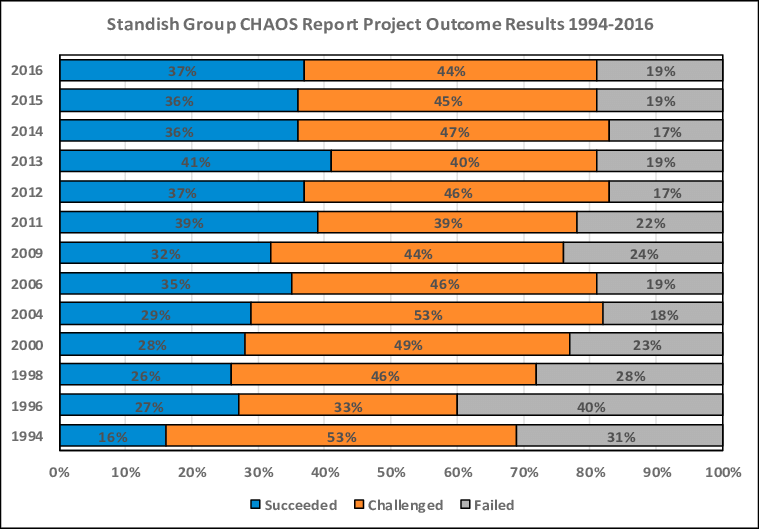
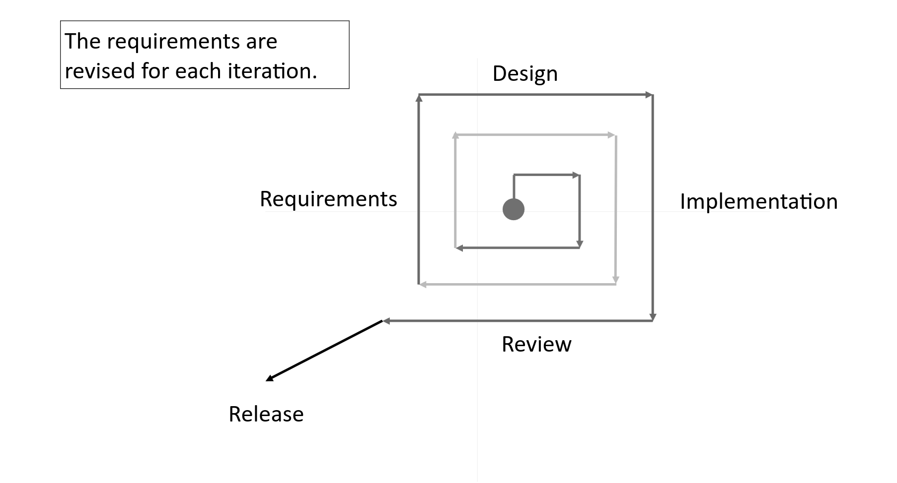
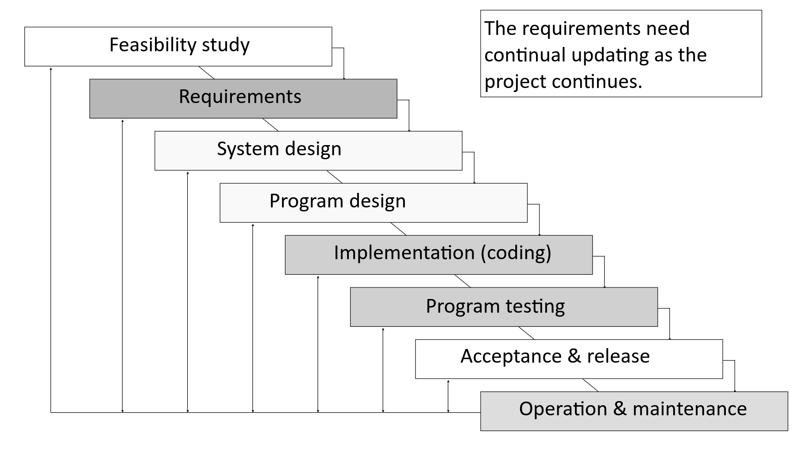
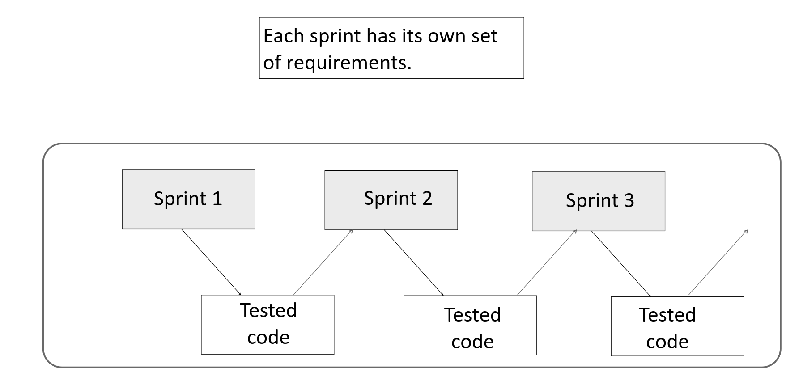

# Intro. Requirements analysis

### Software engineering is hard.

Standish Group realizează anual rapoarte CHAOS asupra unor proiecte de dezvoltare software în organizații medii și mari. 

Studiază ~ 50k proiecte pe an.

Proiectele sunt evaluate și împărțite în trei categorii:

 - Succeeded
 - Challenged (a avut loc o livrare, dar cu întârziere, depășire de buget, ori a unui produs cu funcționalitate redusă).
 - Failed (anulate, fără livrare) 

## Activități de inginerie software

 - requirements analysis (requirements engineering)
 - design/modelare
 - construcție/implementare
 - testare/debugging
 - mentenanță/evoluție

#### [Requirements analysis](https://en.wikipedia.org/wiki/Requirements_analysis) 
Identificarea a *ce* trebuie să facă software-ul (nu și *cum*).

Provocări: 

 - mai mulți stakeholders cu cerințe diferite – cum rezolvăm conflictele?  
 - prioritizare – ce cerințe trebuie rezolvate în ce release?
 - mentenanță – cum abordăm cerințele care se schimbă?

#### Design
Requirements: ce trebuie să facă software-ul?
Design: cum trebuie să o facă?

La un nivel mai înalt decât codul și implică adesea folosirea unui limbaj de modelare, precum UML.

Niveluri de design:

- architectural design
- high-level design
- detailed design

Provocări:

- understandability/eleganță
- adecvarea la schimbarea cerințelor
- securitate 
- efficiență
- împărțirea responsibilității

#### Construcție/implementare

Mai general decât scrierea codului, incluzând design detaliat, coding, unit testing, gestiunea evoluției codului, scrierea de documentație developer-oriented.

Provocări: scalabilitatea. 

#### Testare/debugging

Testare: la niveluri multiple, de la scrierea de unit tests înainte de programare, până la testarea la nivel de client. 

Debugging: de la "ce linie de cod determină crash-ul?" până la "de ce le este greu utilizatorilor să facă asta?"

Provocări:

- costuri – cum să testăm eficient? 
- tooluri pentru testare și debugging

#### Mentenanță/evoluție
Orice schimbare postrelease: reparare de buguri, extinderea funcționalității, îmbunătățirea mentenabilității.

Provocări:

- menținerea flexibilității
- cât continuă un sistem să evolueze și când e necesară înlocuirea lui?

### Requirements și modele de dezvoltare software

## Requirements engineering

Tipuri de cerințe:

 - [cerințe funcționale](https://en.wikipedia.org/wiki/Functional_requirement) (servicii): ce ar trebui să facă sistemul
 - [cerințe non-funcționale](https://en.wikipedia.org/wiki/Non-functional_requirement) (constrângeri sau cerințe calitative): e.g. cât de rapid ar trebui să fie sistemul?; cât de rar sunt permise eșecurile; ce standarde trebuie să respecte?; cât de ușor să fie de folosit?
- distincția între cele două categorii nu e mereu clară: e.g. elementele de securitate

#### Stakeholders

Cerințele vin din partea mai multor părți interesate:

- end users
- clienți
- organizații de reglementare guvernamentale
- architecții de sistem
- software developers
- software testers

####  Activități de requirement engineering

- colectare (elicitation, discovery)
- sortare (analysis)
- scriere (specification)
- verificare (validation)

Activitățile se suprapun adesea; nu se execută secvențial, sunt iterate. Mai multe abordări posibile pentru fiecare tip de activitate. 

Sunt foarte importante; identificarea greșită a cerințelor este cauza principală a eșecului proiectelor software conform rapoartelor Standish CHAOS.

Cauze ale eșecului proiectelor software

1. *Incomplete requirements* - 13.1%
2. *Lack of user involvement* - 12.4%
3. Lack of resources - 10.6%
4. *Unrealistic expectations* - 9.9%
5. Lack of executive support - 9.3%
6. *Changing requirements & specifications* - 8.8%
7. Lack of planning - 8.1%
8. *System no longer needed* - 7.5%

#### Colectarea cerințelor

Surse:

- scopuri: obiective high-level ale software-ului
- domain knowledge: esențial pentru înțelegerea cerințelor
- stakeholders: vital, dar aceștia pot avea dificultăți în exprimarea cerințelor 
- business rules: e.g. regulamente interne 
- environment operațional: e.g. timing și performanță
- environment organizational: cum se încadrează softul în practicile existente?

Tehnici:

- interviuri: 

    - metoda tradițională: întreabă-i ce vor/fac
    - provocări: jargon, omisiuni
- scenarii: 

    - posibile interacțiuni-tip cu sistemul 
    - oferă un context/cadru pentru formularea de întrebări
    - permit formularea de întrebări "ce-ar fi dacă?" și "cum ai face asta?"
    - mai ușor pentru stakeholderi să relaționeze cu situațiile date
    - pot fi surprinse ca [*user stories*](https://en.wikipedia.org/wiki/User_story) și *use cases*. *User stories* sunt folosite în procese de dezvoltare de tip [Agile](https://en.wikipedia.org/wiki/Agile_software_development) (lightweight), e.g. Extreme Programming (XP). Sunt scurte și scrise de client.

- prototipuri:

   - e.g. mock-ups, storyboards, versiuni preliminare ale sistemului
   - precum scenariile, dar mai realiste; ajută în rezolvarea ambiguităților
- observație:
   - potrivită atunci când se înlocuiește un sistem deja existent
   - adesea nepotrivită în inovare    
   - permite descoperirea detaliilor adesea omise de stakeholderi
   - metodă imersivă, dar scumpă

#### Analiza cerințelor

 Colectarea cerințelor conduce adesea la obținerea unei mulțimi de cerințe 
-  contradictorii
-  prea mare pentru a permite implementarea lor completă

Analiza cerințlor este procesul de obținere a unei singure mulțimi consistente de cerințe, clasificate și prioritizate, pentru a fi implementate.

#### Specificarea cerințelor

Moduri de a înregistra cerințele:

-  cu mijloace informale, e.g. note scrise de mână în dezvoltarea agile
-  documente scrise folosind un limbaj structurat, e.g.

*1.1.2.1 The system shall... for an essential feature*

*1.1.2.2 The system should... for a desirable feature*

- modele use case models cu descrieri textuale
- specificații formale în limbaje bazate pe teorii matematice

Sunt necesare exprimări diferite ale cerințelor în funcție de stakeholderi:

- user requirements:
   - high-level
   - ținta: end users și cumpărători
   - pre-contract
- system requirements:
   - mai detaliate
   - ținta: dezvoltatori; reviewed de utilizatori
   - post-contract 

#### Validarea cerințelor

Verificăm cerințele pentru:

- validitate (reflectă nevoi reale? sunt la zi?)
- consistență
- completitudine
- realism (pot fi îndeplinite având în vedere constrângerile de timp și buget?)
- verificabilite (pot fi testate?)

## Boilerplates

cerințe -> cod

cerințe -> model abstract -> cod

cerințe -> boilerplates -> model abstract -> cod

Boilerplate: text parametric (i.e. text cu placeholdere de completat) care se situează între exprimarea liberă și cea semi-formală.

#### Extra reading

1. ["From boilerplated requirements to Alloy: half-way
between text and formal model", Daniel Cadete et. al.](https://www.researchgate.net/profile/Jose-Oliveira-122/publication/307968380_From_boilerplated_requirements_to_Alloy_half-way_between_text_and_formal_model/links/57d45a4c08ae6399a39222d8/From-boilerplated-requirements-to-Alloy-half-way-between-text-and-formal-model.pdf)

2. ["Requirement Boilerplates: Transition from
Manually-Enforced to Automatically-Verifiable
Natural Language Patterns", Chetan Arora et. al.](https://www.researchgate.net/publication/286746122_Requirement_boilerplates_Transition_from_manually-enforced_to_automatically-verifiable_natural_language_patterns)

3. ["Using statement-level templates to improve the quality of requirements", Jeremy Dick, Juan Llorens](https://www.researchgate.net/publication/313599554_Using_statement-level_templates_to_improve_the_quality_of_requirements)

### SRS Documents

[IEEE Recommended Practice for Software Requirements Specifications](https://ieeexplore.ieee.org/document/720574) +
[pdf](https://cse.msu.edu/~cse870/IEEEXplore-SRS-template.pdf)

## Bibliografie

Sommerville, *Software Engineering*, Tenth Edition, 2016 – Chapter 4, Requirements Engineering

