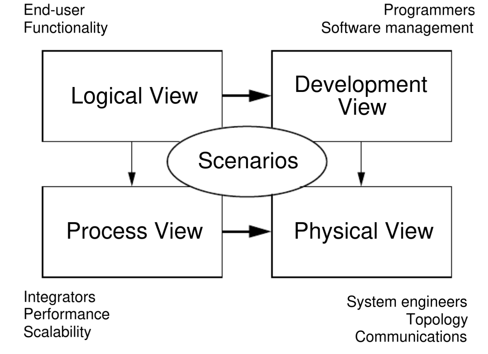
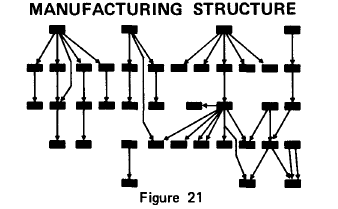
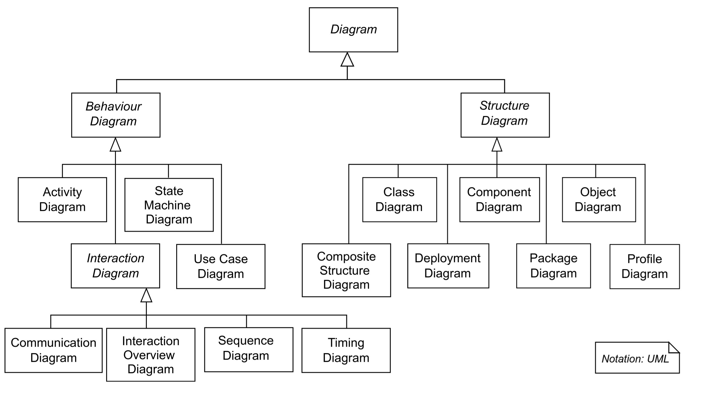

# Modelarea sistemelor. Perspective și diagrame

## Modelarea sistemelor 

 - procesul de dezvoltare a unor modele abstracte ale unui sistem software
 - adesea înțeleasă ca reprezentarea unui sistem folosind o notație grafică bazată pe diagrame (din limbajul UML), însă poate consta din realizarea de modele formale (matematice), de exemplu sub forma unor specificații detaliate
 
### Model

 - reprezentare abstractă a unei specificații, unui design sau sistem, dintr-o perspectivă anume
 - adesea reprezentat vizual de o diagramă sau mai multe
 - simplificare a realității: exprimă esențialul unui aspect al lucrului pe care îl studiem, fără a include detalii nenecesare
 - pot fi informale sau formale; cu cât e mai complex un proiect, cu atât mai valoroase devin modelele formale
 - scop: să permită celor implicați în dezvoltarea unui sistem să se gândească la și să discute probleme și soluții în mod eficient

### Principii ale modelării

 - *ce tip de model să folosim?* -- alegerea tipului de model folosit influențează modul în care gândim despre o problemă și cum propunem soluții pentru ea
 - *câte modele?* -- niciun tip de model nu e suficient în izolare. Sistemele netriviale necesită o mulțime de modele diferite, independente
 - *ce lăsăm pe dinafară?* -- alegerea nivelului de precizie la care exprimăm un model depinde de fiecare caz în parte

### Când modelăm?

Modelele sunt folosite:

 1. în timpul procesului de requirements engineering pentru a obține cerințe detaliate ale unui sistem
 2. în timpul procesului de design pentru a descrie sistemul inginerilor care îl implementează
 3. după implementare pentru a documenta structura și modul de operare a sistemului

### Ce modelăm?

1. Sisteme existente:

- în timpul procesului de requirements engineering pentru a clarifica ce face un sistem 
- modelele pot fi folosite pentru a direcționa dialogul stakeholderilor asupra punctelor tari și slabe ale sistemului.

2.  Sisteme noi:
- în timpul procesului de requirements engineering pentru a explica stakeholderilor cerințele propuse 
 - inginerii folosesc modelele apoi pentru:
   - a discuta propuneri de design
   - documenta sistemul pentru implementare
- în procese de inginerie model-driven, se generează implementări complete sau parțiale din modelele sistemului

###  Perspective

Modelele pot reprezenta un sistem din mai multe perspective:

1. externă -- modelarea contextului sau mediului sistemului
2. a interacțiunii -- modelarea interacțiunilor dintre sistem și mediu, ori între componentele sale
3. structurală -- modelarea organizării sistemului ori a structurii datelor procesate de sistem
4. comportamentală -- modelarea comportamentului dinamic al sistemului și cum reacționează la diverse evenimente

### Axe

Distingem modelele pe mai multe axe:
- un model *use case* descrie un sistem din punctul de vedere al utilizatorilor
- un model *static* descrie elementele care alcătuiesc un sistem și relațiile dintre ele 
- un model *dinamic* descrie comportamentul sistemului în timp

### [Views](https://en.wikipedia.org/wiki/View_model)

Philippe Kruchten (['4 + 1' view model of architecture](https://www.researchgate.net/publication/220018231_The_41_View_Model_of_Architecture)):

1. *logical view* 
- ce părți se potrivesc semantic? Care sunt clasele din sistem și care sunt legăturile dintre ele? 
- modelarea din acest view ajută la verificarea îndeplinirii cerințelor funcționale
2. *process view* 
-  ce threaduri de control avem? Ce lucruri se pot întâmpla concurent?, când trebuie să aibă loc sincronizări? 
- modelarea din acest view asigură că cerințele nonfuncționale precum cele de performanță și disponibilitate sunt îndeplinite
3. *development view*
- ce părți pot fi dezvoltate de aceeași echipă de dezvoltatori?, ce părți pot fi refolosite?
- modelarea din acest view ajută la gestiunea proiectului
4. *physical view* 
- ce părți vor rula pe același calculator? 

### Scopul determină precizia 

Cele mai comune trei scopuri pentru folosirea modelelor:

1. pentru a stimula și direcționa discuțiile (între ingineri) despre un sistem existent sau propus: modelele pot fi incomplete și pot folosi notațiile de modelare informal (e.g. în modelarea agile)

2. pentru a documenta un sistem existent: deși pot fi incomplete (documentarea doar a unor părți din sistem), trebuie să fie corecte și să ofere o descriere precisă a sistemului

3. pentru a detalia o descriere de sistem care să fie folosită pentru a genera o implementare: modelele trebuie să fie corecte și complete

## Limbaje de modelare

Un limbaj de modelare:

- este un mod de a realiza modele în timpul procesului de dezvoltare software
- definește o colecție de elemente din care se compune un model
- de regulă diagramatic, dar poate fi bazat și pe text
- are:
   - sintaxă -- într-un limbaj de modelare bazat pe diagrame, regulile care determină ce diagrame sunt permise
   - semantică -- regulile care determină ce înseamnă o diagramă permisă
- majoritatea limbajelor de modelare au sintaxa și semantica definite informal, în limbaj natural

## Scurt istoric al modelării în SE

[Zurcher, F.W. and Randell, B. Iterative multi-level modelling, A
methodology for computer system design](http://homepages.cs.ncl.ac.uk/brian.randell/PapersInProceedings/336.pdf),
IFIP Congress, Edinburgh, August 5-10, 1968

### Modelare grafică

Diagrame

- organizaționale (*organisation charts*)
- PERT/CPM (program evaluation and review
technique/critical path method)
- genealogice

folosite ca analogii în primele lucrări de inginerie software.

Primele diagrame/modele de inginerie software erau data-oriented și de mici dimensiuni. 

Un model "foarte mare" (Bachman, 1969):

### Modele vechi

- Modele statice (de structură): la început, văzute doar ca desene, nu obiecte formale. În 1967, Chen prezintă ideea că reprezentările diagramatice pot fi izomorfe cu cele simbolice. 
- Modele dinamice: flowcharts (e.g. Gilbreth, 1921);
automate (e.g. Taylor Booth, 1967 "Sequential
Machines and Automata Theory"); Harel statecharts (1980);
message sequence charts (1990)

### Modelare orientată pe obiecte

Explozia dezvoltării OO: o mulțime de *gurus*, fiecare susținând propria companie, tool, carte, notație pentru modelare, printre care și Booch, Rumbaugh, Jacobson, cei "trei amigos" care au inițiat UML (Unified Modeling Language), dar și Coad, Odell, Schlaer și Mellor, Wirfs-Brock etc.

## [Unified Modelling Language (UML)](https://en.wikipedia.org/wiki/Unified_Modeling_Language)

- a apărut în anii '90 în contextul unor proiecte de modelare orientată pe obiecte: mai multe notații orientate pe obiecte similare au fost integrate pentru a defini un limbaj
- în 1997, standardizarea UML (UML 1.0): "The methods war is over: we won." – Booch și Rumbaugh.
- revizie majoră (UML 2) finalizată în 2004
- UML 2.0 format din 13 tipuri de diagrame 
- UML 2.5 format din 15 tipuri de diagrame
- universal acceptat ca abordarea standard pentru modelarea sistemelor software
- variante, precum SysML, au fost propuse pentru o modelare mai generală 

### De ce avem nevoie de un limbaj unificat? 

Limbajul de modelare ales trebuia să fie:

1. suficient de expresiv pentru a descrie aspectele de design necesare pentru a fi discutate și să reflecte în mod semnificativ schimbările de design în schimbări în modele
2. ușor de folosit
3. neambiguu
4. să existe unelte corespunzătoare utile (e.g. pentru dezvoltarea facilă a diagramelor, nu cu unelte de desenat standard)
5. suficient de larg folosit în comunitate

### UML core?

Un sondaj a arătat că majoritatea utilizatorilor UML consideră că 5 tipuri de diagrame pot surprinde esența unui sistem:

 1. [diagrame de activități](https://en.wikipedia.org/wiki/Activity_diagram) -- arată activitățile implicate într-un proces ori în procesarea datelor
 2. [diagrame use case](https://en.wikipedia.org/wiki/Use_case_diagram) -- arată interacțiunile între un sistem și mediu (environment)
 3. [diagrame de secvență](https://en.wikipedia.org/wiki/Sequence_diagram) -- arată interacțiunile între actori și sistem și între componentele de sistem
 4. [diagramele de clasă](https://en.wikipedia.org/wiki/Class_diagram) -- arată clasele de obiecte din sistem și legăturile dintre aceste clase
 5. [diagrame de stare](https://en.wikipedia.org/wiki/UML_state_machine) -- arată cum sistemul răspunde la evenimente interne și externe

### UML Rules of Thumb. UP or DOWN?

1. Nearly everything in UML is optional
2. UML models are rarely complete
3. UML is designed to be open to interpretation
4. UML is intended to be extended

### UML dead? 

- majoritatea celor ce lucrează în industria ingineriei software nu folosesc UML, ci diagrame informale ce includ elemente preluate din UML.

- [Google Trends](https://trends.google.com/trends/explore?date=all&geo=US&q=UML&hl=en): UML în declin din 2004. 

- Visual Studio nu mai oferă suport pentru UML din 2016. 

## Bibliografie

 - *Software Engineering*, Ian Sommerville, Tenth Edition – Chapter 5, System Modeling
 - *UML 2.0 in a Nutshell*, Dan Pilone, Neil Pitman - Chapter 1, Fundamentals of UML
 - *Using UML*, Perdita Stevens, Rob Pooley - Chapter 4, The development process

