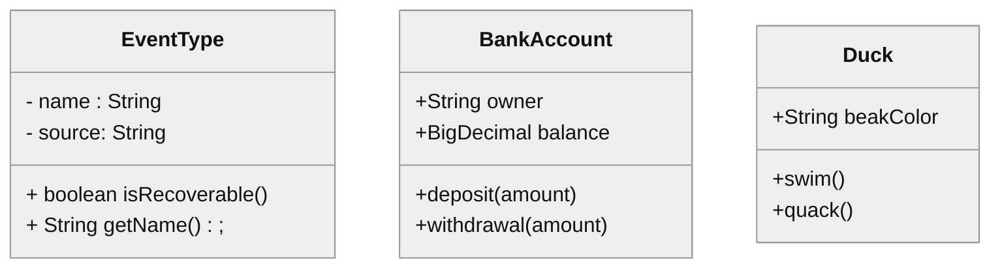
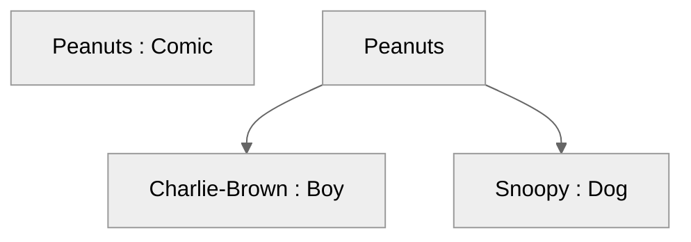
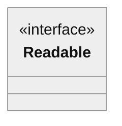
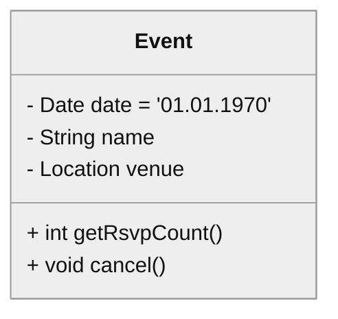
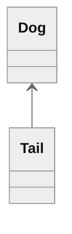
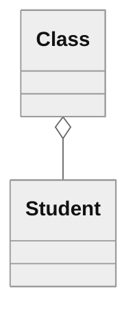
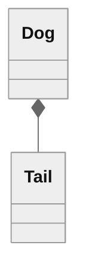
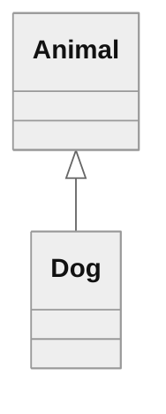
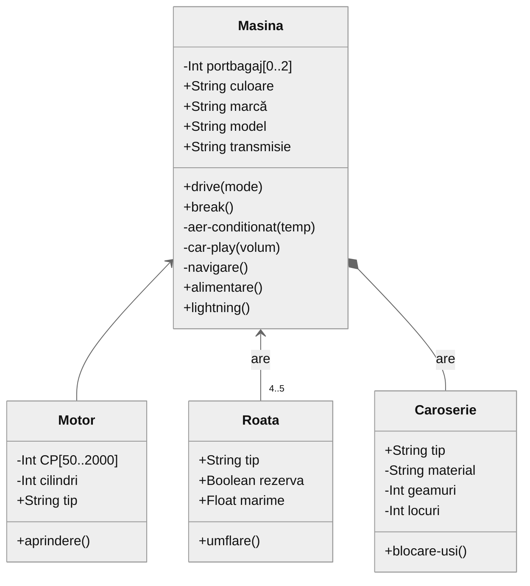

# Diagrame de clasă (*class diagrams*)

Diagramele de clasă sunt printre cele mai versatile și mai importante diagrame UML. Sunt diagrame structurale; folosite pentru a surprinde relațiile statice dintr-un sistem software. 

## Clase

În UML, o *clasă* reprezintă o colecție de obiecte (lucruri, tangibile sau nu, concrete sau abstracte) care au o stare și/sau un comportament comun. O clasă dintr-o diagramă UML de clasă poate reprezenta o clasă dintr-un limbaj de programare orientată pe obiecte, o entitate într-o diagramă ER a unei baze de date, o componentă sau un modul al unui sistem, o instanță propriu-zisă a unui obiect, etc.

## Reprezentare / sintaxă

Elementul grafic pentru reprezentarea unei clase este recomandat să aibă între 1 și 3 *compartimente* -- dreptunghiuri suprapuse vertical, care conțin numele, atributele și operațiile clasei.




### Numele

Conform sintaxei UML, numele unei clase trebuie să înceapă cu o majusculă, însă acest lucru depinde până la urmă de regulile interne de denumire și de reprezentarea propriu-zisă a claselor. Numele trebuie să fie scris cu **bold**, pentru o citire mai ușoară. Dacă este scris cu litere _italice_, în cele mai multe cazuri reprezintă o clasă abstractă (se recomandă însă de asemenea folosirea unui clasificator în acest caz).

Dacă elementul grafic de clasă trebuie să reprezinte o instanță propriu-zisă a unui obiect, numele poate fi scris folosind patternul `<<instance name>>:<<type>>`. 

Exemplu:



Dacă clasa are un clasificator (precum în limbajele de implementare pe care le cunoașteți -- interfețe, enumerații, excepții), acesta poate fi specificat aici, deasupra numelui, între paranteze unghiulare (e.g. `<<interface>> Readable`).



### Atribute

Atributele reprezintă stări sau anumite detalii ale unei clase. Atributele pot avea fie tipuri primitive (în funcție de ceea ce este considerat primitiv în percepția utilizatorului -- întregi, numere float etc.) sau tipuri complexe -- cu care poate fi în relație. Pentru fiecare atribut pot fi reprezentate și caracteristici precum vizibilitatea, multiplicitatea, ordinea sau anumite restricții.

Dacă un atribut se aplică întregii clase (nu este legat de o instanță anume; ca în cazul atributelor statice în majoritatea limbajelor de programare), acest lucru este reprezentat prin subliniere.

Exemplu:



#### Reprezentare / sintaxă

```
vizibilitate / nume : tip multiplicitate = default {proprietăți sau constrângeri}
```

Prezența caracterului `/` înseamnă că atributul este derivat sau compus. 

#### Vizibilitate

- `+` public 
- `-` private 
- `#` protected
- `~` package

Orice legătură cu modificatorii de vizibilitate/acces din limbajele de implementare este accidentală.

#### Nume 

Numele atributului

#### Tip

Tipul atributului. Poate fi un tip primitiv, sau un alt clasificator, clasă ori interfață.

#### Multiplicitate

Numărul de instanțe ale tipului de atribut. Dacă lipsește, se presupune o multiplicitate de `1`. Dacă este folosit caracterul `*`, se presupune orice număr, inclusiv `0`. Pot fi definite limite explicite folosind formatul `[lower_bound..upper_bound].

#### Default

Valoarea default a atributului. 

#### Proprietăți sau constrângeri

O listă de constrângeri sau informații în plus pentru atribut (e.g. "unique", "only-numbers", "sorted in ascending order", "always > 5", "read-only" etc.).

### Operații

Operațiile sunt caracteristici ale claselor care specifică cum poate fi invocat un anumit comportament.

#### Reprezentare / sintaxă

```
vizibilitate nume ( parametri ) : return_type { proprietăți }
```

unde `parametri` este o listă de elemente de tip:

```
direction nume_parametru : tip [ multiplicitate ] = default { proprietăți }
```

#### Vizibilitate

- `+` public 
- `-` private 
- `#` protected
- `~` package

Orice legătură cu modificatorii de vizibilitate/acces din limbajele de implementare este accidentală.

#### Nume

Numele operației

#### Direction

Cum este folosit parametrul. Poate fi una din valorile:

- `in` -- parametrul este trimis operației de către apelant
- `inout` -- parametrul este trimis operației de către apelant și poate fi modificat de către operație și trimis înapoi
- `out` -- parametrul nu este setat de apelant, dar este modificat de operație și trimis apelantului
- `return` -- valoarea setată de apelant este trimisă înapoi ca return value.

#### Nume parametru

Numele parametrului

#### Tip parametru

Tipul parametrului. Poate fi un tip primitiv sau un tip complex.

##### Multiplicitate parametru

Numărul de instanțe ale parametrului. Vezi definiția pentru multiplicitatea atributelor.

#### Valoare default parmetru

Valoarea default a parametrului.

#### Proprietăți parametru

Specifică constrângeri și proprietăți asociate cu un parametru.

#### Return type

Tipul de informație întoarsă după execuția operației. Dacă nu este întoarsă nicio informație, atunci folosim  `void` ca return type. 

#### Properties

Specifică constrângeri și proprietăți asociate cu o operație.

## Relații

În izolare, clasele nu ar oferi prea mult insight în ceea ce privește designul unui sistem. UML permite reprezentarea relațiilor dintre clase în mai multe moduri. 

### Dependență

Dependența între clase presupune că una dintre clase folosește sau are acces la altă clasă. Este de regulă o relație temporară; o clasă dependentă interacționează pentru puțin timp cu clasa țintă, dar nu menține de obicei o legătură de lungă durată cu aceasta. Se mai numește și o relație de tip `... uses a ... ` (`... folosește ...`). Este reprezentată ca o săgeată punctată între două clase.

### Asociere

Asocierile indică faptul că o clasă menține o legătură cu o altă clasă pentru o perioadă de timp extinsă. Existența a două obiecte aflate în relație este probabil independentă (distrugerea unui obiect nu conduce la distrugerea celuilalt obiect). Se mai numește și o relație de tip `... has a ...` (`... are ...`). Este reprezentată ca o săgeată.



### Agregare

Agregarea este o versiune mai puternică a asocierii. Spre deosebire de asociere, agregarea implică de regulă proprietatea (*ownership*) și poate presupune o dependență a existenței obiectelor în relație. Agregarea este de regulă citită ca `...owns a...` (`... deține ...`). Este reprezentată cu o linie continuă între cele două clase care are un romb în dreptul clasei ce deține cealaltă clasă. 



### Compunere

Compunerea este o relație puternică între clase, ce merge până la conținere. Este  folosită pentru a surprinde relațiile întreg-parte (*whole-part*). Clasa "parte" în relație poate fi implicată doar într-o singură relație de compunere la un moment dat. Existența instanțelor implicate în relații de compunere este aproape mereu în legătură; dacă partea mai mare, ce conține, este distrusă, presupune aproape mereu distrugerea părții mai mici, conținute. Relația este de regulă citită ca `... is a part of ... ` (`... este parte a ...`). Se reprezintă folosind o săgeată cu linie continuă către clasa conținută ce are un romb plin în dreptul clasei ce conține cealaltă clasă.



### Generalizare

O relație de generalizare presupune că ținta relației este o versiune mai generală, mai puțin specifică, a clasei sau interfeței sursă. Relațiile de generalizare sunt adesea citite ca `...is a...`, începând cu clasa mai specifică. Sunt reprezentate prin săgeți cu linii continue și capete de săgeată închise de la clasa mai specifică spre clasa mai generală. 



## Exercițiu

Modelați o mașină folosind diagrame de clasă.



### Exercițiu laborator

Modelarea unei parcări folosind diagrame de clasă.

## Cu ce desenăm diagrame?

1. [Mermaid](http://mermaid.js.org/), 4 Github, a la Markdown.
[Sintaxă diagrame de clasă](http://mermaid.js.org/syntax/classDiagram.html)
2. [Lucidchart](https://www.lucidchart.com)
3. [app.diagrams](https://app.diagrams.net/)
4. [Visual Paradigm](https://online.visual-paradigm.com/diagrams/solutions/free-class-diagram-tool/)

## Bibliografie

 - *UML 2.0 in a Nutshell*, Dan Pilone, Neil Pitman - Chapter 2, Class Diagrams
 - *Using UML*, Perdita Stevens, Rob Pooley - Chapter 5, Essentials of class models & Chapter 6, More on class models

