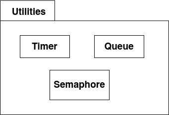
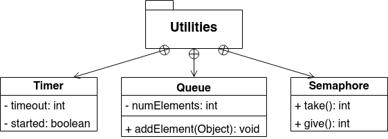
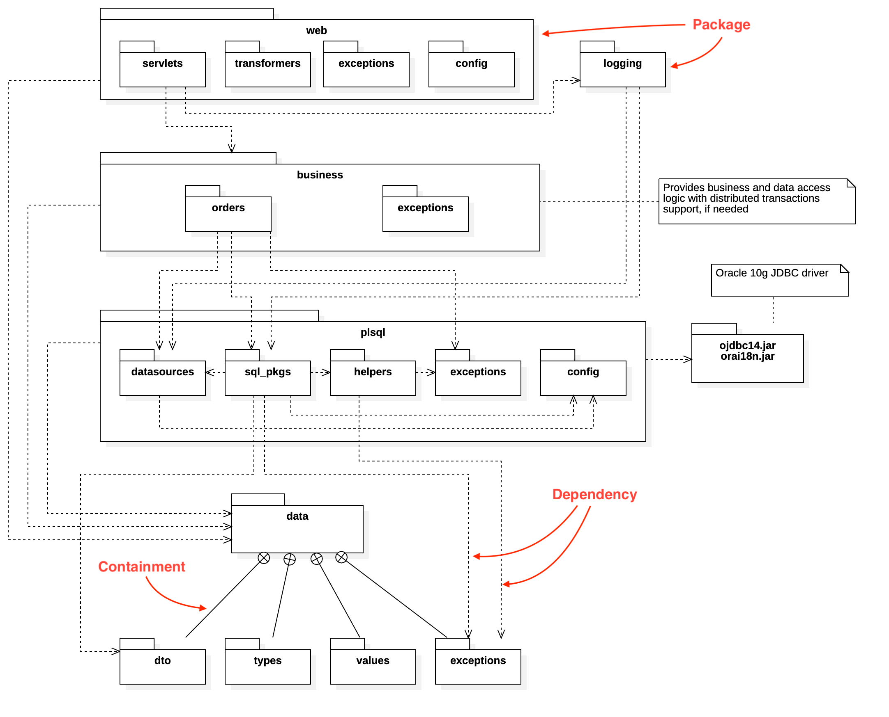
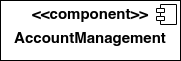
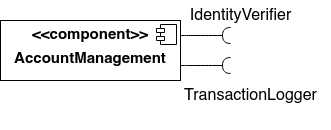
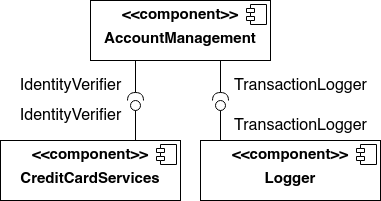
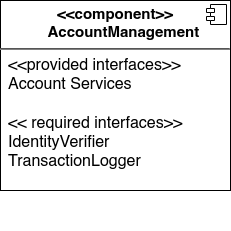
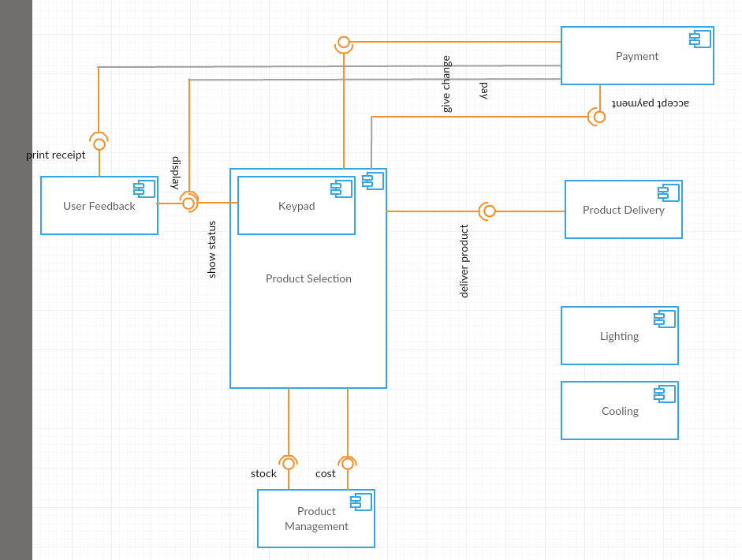
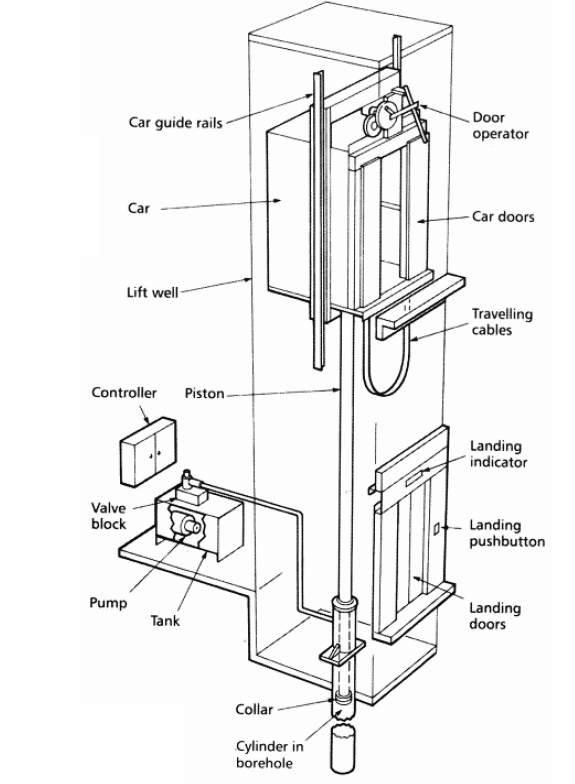

# Diagrame de pachete și de componente  

## Diagrame de pachete (*package diagrams*)

Pachetele oferă un mod de a grupa elemente și de a defini domenii de vizibilitate (*scope*). Folosirea diagramelor de pachete este utilă pentru vizualizarea dependențelor dintre diferite părți ale unui sistem. Sunt folosite adesea în etapele de identificare a problemelor dintr-un sistem sau pentru stabilirea ordinii de compilare.

### Namespaces

Aproape toate elementele UML pot fi grupate în pachete, inclusiv pachetele însele. Fiecare pachet are un nume care determină domeniul de vizibilitate (scope) pentru fiecare element pe care îl conține. 

*Exemplu*: presupunând că avem o clasă denumită `Timer` într-un pachet denumit `Utilities`, numele complet al clasei, conținând scope-ul său este `Utilities::Timer`. Elementele unui pachet pot face referire la alte elemente din același pachet fără calificatori (numele pachetului).

### Reprezentare / sintaxă

Reprezentăm un pachet folosind un dreptunghi cu un *tab* în colțul din stânga sus.

Reprezentarea elementelor unui pachet poate fi făcută în două moduri:

1. desenând elementele în interiorul unui dreptunghi ce conține numele pachetului într-un tab din colțul din stânga sus

2. desenând o săgeată de la element la pachetul care îl conține; săgeata are linie continuă și se termină cu un cerc ce conține un "+"

### Vizibilitate

Un pachet poate specifica informații legate de vizibilitatea elementelor conținute sau importate; elementele pot avea doar unul din două niveluri de vizibilitate: public sau privat.

- vizibilitatea publică (+) : elementul poate fi folosit în afara pachetului (cu numele pachetului ca *scope*) 
- vizibilitatea privată (-) : elementul poate fi folosit doar de alte elemente din același pachet; folosită la marcarea claselor utilitare care implementează un subsistem sau o componentă pe care nu dorim să le expunem întregului sistem.

### Import & accesare

UML permite reprezentarea importăriii de pachete folosind o săgeată punctată de la pachetul care importă la cel importat, însoțită de o etichetă cu cuvântul-cheie `<<import>>`.

Elementele importate au de regulă vizibilitate publică în pachetul în care sunt incluse. UML permite specificarea unei vizibilități private (nu pot fi folosite în afara pachetului care le importă, inclusiv alte pachete ce importă acest pachet care le importă direct) folosind cuvântul-cheie `<<access>>`.

UML mai permite și reprezentarea unificării (*merging*) pachetelor ce, spre deosebire de import, presupune crearea de relații între clase cu același nume. Când un pachet este unificat cu alt pachet, orice clasă cu același tip și nume extinde în mod automat (are o relație de generalizare cu) clasa originală. Se reprezintă folosind săgeți punctate cu eticheta `<<merge>>`.

###  *Dar de ce?* -- exemplu

 layering + simplificare

## Diagrame de componente (*component diagrams*)

Modelarea sistemelor mari este dificilă fără împărțirea lor în subsisteme sau părți mai mici. UML folosește conceptul de `componentă` pentru a reprezenta o parte înlocuibilă, puțin legată, a unui sistem mai mare, fără a înregistra multe detalii despre modul în care aceasta funcționează sau este implementată.

Interacțiunile între componentele sistemului sunt reprezentate prin interfețe expuse prin porturi.
 
### Reprezentare / sintaxă

În UML 2.0, o componentă se reprezintă ca un dreptunghi în care numele este scris centrat și însoțit de calificatorul `<<component>>`, iar în partea dreaptă-sus are o iconiță  de `componentă` (un dreptunghi cu două dreptunghiuri mai mici în partea stângă).

### Dependențe

Componentele pot avea nevoie de alte componente pentru a implementa funcționalitatea dorită. Dependențele între componente sunt reprezentate prin săgeți punctate.

### Interfețe

Componentele pot fi prezentate fie:

- din perspectiva *black-box*: nu sunt oferite detalii de implementare, doar interfețele necesare (*required*) și oferite (*exposed*; funcționalitatea oferită)
- din perspectiva *white-box*: sunt arătate și elementele interioare ale componentei. 

Funcționalitățile required și oferite sunt reprezentate folosind o linie solidă ce pornește de la componentă (punctul de intersecție, adesea reprezentat cu un dreptunghi mic, se numește port) și care se termină fie cu un cerc (interfețe oferite), fie cu un socket (semicerc; interfețe required). 

### Exemplu

### Exercițiu

Modelați un lift folosind diagrame de componente.

## Cu ce desenăm diagrame?

1. [app.diagrams](https://app.diagrams.net/)
2. [Lucidchart](https://www.lucidchart.com)
3. [Mermaid](http://mermaid.js.org/), 4 Github, a la Markdown.
4. [Visual Paradigm](https://online.visual-paradigm.com/diagrams/solutions/free-class-diagram-tool/)

## Bibliografie

 - *UML 2.0 in a Nutshell*, Dan Pilone, Neil Pitman - Chapter 3, Package Diagrams & Chapter 5, Component Diagrams
 - *Using UML*, Perdita Stevens, Rob Pooley - Chapter 14, Packages and models

