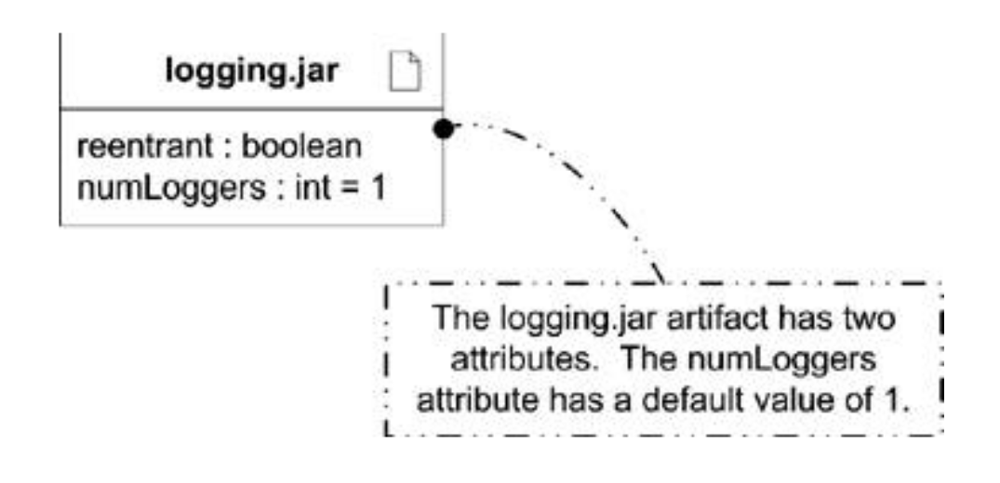
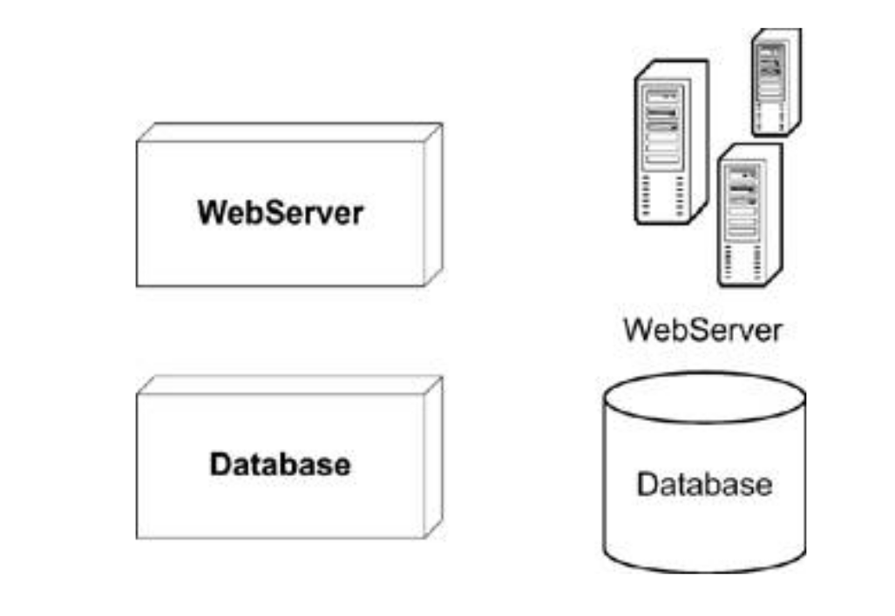
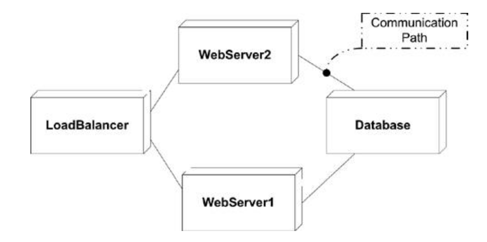
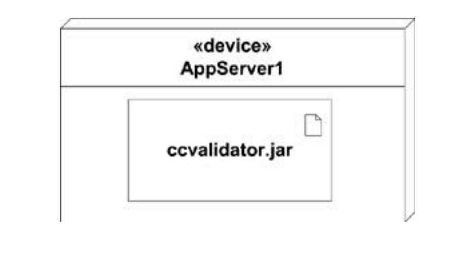
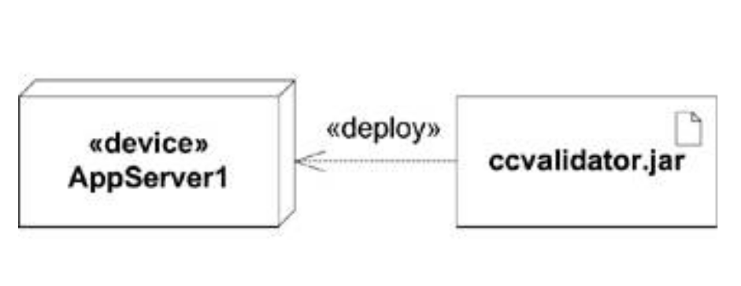

# Diagrame de deployment

## Diagrame de deployment

Diagramele de deployment reprezintă legăturile dintre produsele software și hardware-ul pe care vor rula acestea. 

Diagramele de deployment sunt utile în:

- *system planning*: cum va fi implementat un sistem pe dispozitive diferite
- designul infrastructurii (stabilirea hardware-ului necesar)
- alocarea resurselor
- analiza dependențelor: cum depind diferite parți ale sistemului software unele de altele dar și de hardware
- optimizarea performanței sistemelor
- planificarea securității

Diagramele de deployment sunt folosite mai ales de dev ops și administratori de sistem ca să descrie:

- modelarea unei topologii de rețea 
- modelare sistemelor distribuite 
- sisteme de forwards și reverse engineering

Elementele software (componente, clase, cod compilat) sunt reprezentate ca artefacte (*artifacts*): dreptunghiuri ce conțin numele elementelor și o iconiță sub formă de fișier în colțul din dreapta-sus. 

Artefactele pot avea proprietăți/atribute și operații.

Artefactele reprezintă de regulă tipuri de elemente. Este util să reprezentăm și instanțe ale artefactelor -- subliniind numele elementelor (e.g. copii fizice ale unor fișiere cu cod). Artefactele sunt de regulă manifestări (*manifestation*) are altor elemente UML (componente, de exemplu). Reprezentăm acest lucru prin linii punctate cu eticheta `<<manifest>>`.

Artefactele sunt desenate de obicei în interiorul unor *noduri* (containere) ce reprezintă elemente hardware ce pot găzdui/executa un artefact (dispozitiv, mediu de execuție etc.). Nodurile sunt reprezentate ca paralelipipede dreptunghice etichetate cu nume scrise îngroșat. 

Un mediu de execuție (*execution environment*) este un nod specializat care găzduiește un tip anume de artefacte. Este de așteptat ca un mediu de execuție să ofere servicii specifice artefactelor găzduite (e.g. o pagină web are nevoie de anumite funcționalități de la un server web: load balancing, compilatoare dedicate, etc.). Putem reprezenta acest lucru prin crearea unui stereotip (e.g. `<<Web Server>>`) și folosirea lui ca nume al unui nod în interiorul unui nod hardware-based.

Communicarea între noduri este reprezentată sub formă de muchii denumite *communication paths*. Comunicarea fiind de regulă bi-direcțională, nu avem nevoie de săgeți, doar de linii (continue). 

Când asociem un artefact cu o țintă de deployment (*deployment target*), spunem că îi facem *deploy*. Reprezentăm deploymentul desenând un artefact în interiorul unui nod, cu o săgeată cu linie punctată și eticheta `<<deploy>>`, sau listând toate artefactele deployed într-un nod.

Pot fi folosite și *specificații de deployment* (liste de proprietăți) pentru detalierea modului în care un artefact trebuie deployed într-un nod țintă.

### Deployment patterns

Diagramele de deployment sunt utile și pentru reprezentarea pattern-urilor de deployment / arhitecturilor:

- Arhitectură client-server
- Arhitectură Three-Tier
- Arhitectură bazată pe microservicii
- Containerizare (e.g. Docker)
- Arhitectură cloud

### Exemple

.webp)

## Cu ce desenăm diagrame?

1. [app.diagrams](https://app.diagrams.net/)
2. [Lucidchart](https://www.lucidchart.com)
3. [Mermaid](http://mermaid.js.org/), 4 Github, a la Markdown.
4. [Visual Paradigm](https://online.visual-paradigm.com/diagrams/solutions/free-class-diagram-tool/)

## Bibliografie

 - *UML 2.0 in a Nutshell*, Dan Pilone, Neil Pitman - Chapter 6, Deployment Diagrams & Chapter 7, Use Case Diagrams
 - *Using UML*, Perdita Stevens, Rob Pooley - Chapter 7, Essentials of use case models & Chapter 8, More on use case models

