# Diagrame use case

## Cazuri de utilizare (*use case*)

Cazurile de utilizare (*use cases*) sunt o metodă de a surprinde funcționalitățile și cerințele unui sistem software. Constau într-o listă de acțiuni sau evenimente care definesc interacțiunile dintre un rol (*actor*; persoană sau lucru/sistem extern) și un sistem pentru a îndeplini un scop.

Sunt folosite:

- ca instrument de modelare a comportamentului în UML
- în documentarea cerințelor de sistem (*software requirements specifications* -- SRS), ca metodă alternativă de înregistrare a cerințelor funcționale
- în dezvoltarea software de tip agile
- în object-oriented software engineering

### Use case = text + diagramă

Definiția unui caz de utilizare în UML presupune:

- o funcționalitate (a unui sistem, a unei componente, a unei clase) cu nume (descriere scurtă a funcționalității)
- actorii care invocă funcționalitatea 
- opțional: elemente responsabile de implementarea cazurilor (subiecți)

Reprezentăm un caz de utilizare (o funcționalitate) folosind un oval ce conține numele funcționalității. 

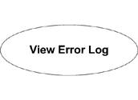
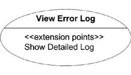
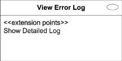

## Actor

Un *use case* trebuie inițiat de *cineva* ori *ceva* din afara domeniului cazului de utilizare: un actor. Acesta nu trebuie să fie neapărat o persoană sau un utilizator; un stimul extern poate declanșa un caz de utilizare de asemenea (e.g. un *system clock* e adesea reprezentat ca un actor ce declanșează un caz de utilizare la un anumit timp sau un anumit interval de timp).

Actorii pot fi reprezentați în mai multe feluri în UML. Cea mai comună reprezentare este cea a unui *stick figure* însoțit de numele actorului.

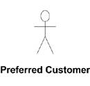

Putem reprezenta un actor și folosind notația cu clasificatori: un dreptunghi cu numele actorului și cuvântul-cheie `<<actor>>`.

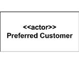

Putem folosi însă și desene specifice (custom) pentru a distinge între tipurile de actori. De exemplu, putem reprezenta un sistem de baze de date extern folosind o iconiță de bază de date și un administrator de sistem folosind un *stick figure*.
 
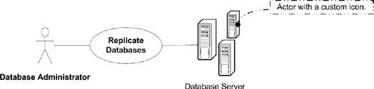

## Asocieri actor/use case

Actorii sunt asociați unuia sau mai multor cazuri de utilizare. O relație între un actor și un use case poate indica faptul că actorul inițiază cazul de utilizare, că use case-ul oferă actorului niște rezultate, ori ambele. De regulă, actorii sunt reprezentați în partea stângă a diagramei, iar cazurile de utilizare în partea dreaptă. 

Deși nu fac parte din specificația oficială UML, putem folosi și săgeți (direcționale) în relațiile (liniile) de asociere, pentru a indica cine inițiază comunicarea. Săgețile nu restricționează însă neapărat direcția de circulație a informației; doar arată cine inițiază și cine e  receiverul în comunicare.

## System boundaries 

Limitele unui sistem pot fi identificate prin izolarea funcționalităților unui subiect anume. Orice nu este îndeplinit de subiect este considerat în afara limitelor sistemului și devine actor. Tehnica este utilă în determinarea/asignarea responsabilităților în etapa de design a unui sistem. Reprezentăm limitele folosind un dreptunghi adnotat cu numele sistemului în partea de sus.

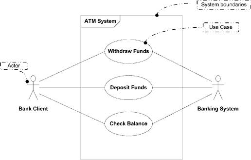

## Generalizare

Putem folosi relații de generalizare între actori și cazuri de utilizare. De exemplu, pentru a reprezenta faptul că un actor poate executa toate sarcinile unui alt actor (abstract): desenăm o săgeată (cu capăt gol) de la actorul mai specific la actorul mai general pentru a indica ca poate iniția și funcționalitățile asociate acestuia, pe lângă cele asociate lui. 

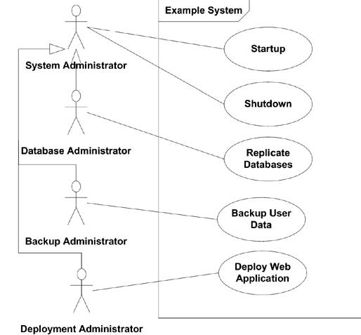

Cazurile de utilizare pot fi generalizate de asemenea. Generalizarea se folosește pentru a descrie o cerință funcțională high-level a unui sistem fără a intra în detalii. 

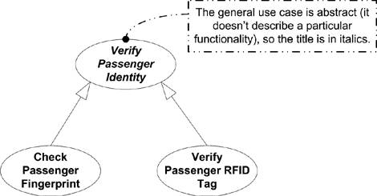

## Incluziunea cazurilor de utilizare

Funcționalitățile comune pot fi extrase din mai multe cazuri de utilizare și incluse în cazuri de utilizare partajate. Un caz de utilizare inclus nu este regulă complet de sine stătător (precum clasele abstracte în OOP). E.g. use case "payment" vs. use case "pay with paypal"/"pay with card". 

Incluziunea este reprezentată cu săgeți cu linie punctată (dependență) și etichete cu cuvântul-cheie `<<include>>`.

## Extinderea cazurilor de utilizare

În anumite condiții, un caz de utilizare poate extinde un altul pentru a oferi funcționalități extra. Diferența dintre incluziune și extindere constă în faptul că un caz de utilizare extins este un caz de utilizare valid în sine.

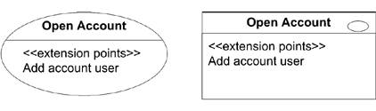
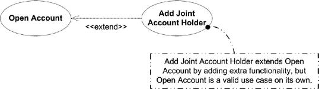

## Time for lunch?

Ce constituie un bun caz de utilizare și ce nu? 
Regulă nescrisă pentru evaluarea complexității: ne întrebăm dacă utilizatorul "poate merge să ia prânzul" după completarea cazului de utilizare (un scop cu dimensiune rezonabilă a fost atins de inițiator). 

## Specificații use case 

Diferența între o diagramă use case diagram și o specificație use case detaliată. 

## Exercițiu 

Modelarea interacțiunilor utilizatorilor cu pagina YouTube folosind diagrame use case.

## Cu ce desenăm diagrame?

1. [app.diagrams](https://app.diagrams.net/)
2. [Lucidchart](https://www.lucidchart.com)
3. [Mermaid](http://mermaid.js.org/), 4 Github, a la Markdown.
4. [Visual Paradigm](https://online.visual-paradigm.com/diagrams/solutions/free-class-diagram-tool/)

## Bibliografie

 - *UML 2.0 in a Nutshell*, Dan Pilone, Neil Pitman - Chapter 7, Use Case Diagrams
 - *Using UML*, Perdita Stevens, Rob Pooley - Chapter 7, Essentials of use case models & Chapter 8, More on use case models

