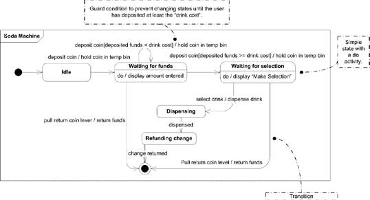
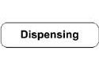
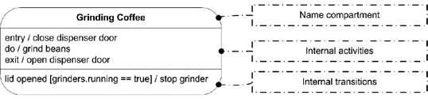
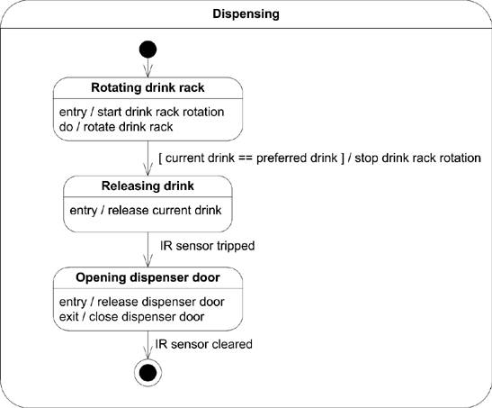
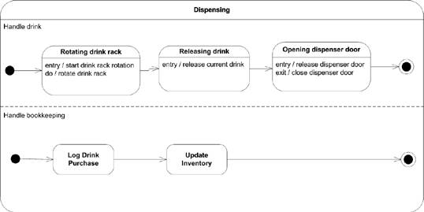
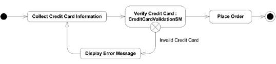
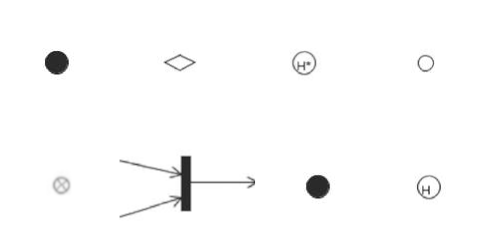
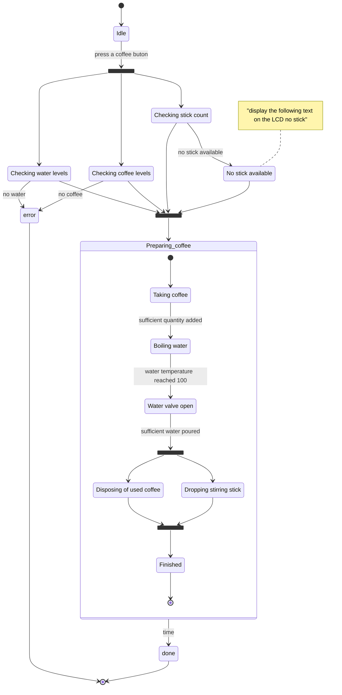

# Diagrame de stare (*statechart/state machine/state diagrams*)

Diagramele de stare surprind comportamentul unui sistem software folosind o notație bazată pe grafuri. Pot fi folosite pentru: 

- modelarea comportamentului unei clase, al unui subsistem, sau al unei întregi aplicații software (*behavioural state machines*)
- modelarea comunicării cu entități externe via un protocol sau un sistem bazat pe evenimente (*protocol state machines*)

## Behavioral state machines (automat/mașină cu stări)

Un *state machine* se reprezintă folosind un dreptunghi cu o etichetă ce îi conține numele în partea din stânga-sus. Este de regulă asociat unui clasificator dintr-un model UML mai mare (e.g. o clasă, un subsistem). Asocierea se poate face folosind o notă. 

Modelarea comportamentului unei mașini cu stări se face folosind stări, pseudostări, activități și tranziții. 

- Tranzițiile între stări au loc când sunt lansate/trimise evenimente (*event dispatch*). 

- În timp ce are loc execuția unei mașini, sunt rulate activități odată cu efectuarea unei tranziții, intrării într-o stare etc. 

Un state machine are o mulțime de puncte de conexiune (*connection points*) ce îi determină interfața externă (pseudostări de intrare/ieșire -- *entry*/*exit*).

## Stări

Stările modelează un moment anume în comportamentul unui sistem. Mai precis, modelează o situație în comportamentul unui sistem în care o condiție invariantă este adevărată. O stare este o condiție de existență ("a condition of being") a unei mașini, și prin asociere, a clasificatorului pe care aceasta îl modelează.

O stare poate reprezenta atât

- o situație statică (e.g. 'waiting for username") cât și
- o situație dinamică; o stare în care sunt procesate activ date (e.g. "encrypting message").

#### Exemplu. 
O mașină cu stări ce modelează un tonomat de cafea poate avea ca stări "Grinding Beans", "Brewing", "Warming Coffee", "Dispensing".

### Reprezentare

O stare se reprezintă folosind un dreptunghi cu colțuri rotunjite ce îi conține numele. 

O stare poate fi împărțită în compartimente:

- numele stării
- o listă de activități interne ce sunt executate atunci când mașina se află în acea stare
- o listă de tranziții interne și evenimentele ce le declanșează. 

O tranziție internă se scrie astfel: 

`event (attributeList ) [ guard condition ] / transition`

Lista opțională de atribute mapează parametrii evenimentului la atributele clasificatorului corespunzător. Condiția este și ea opțională. Un eveniment poate fi listat de mai multe ori; fiecare instanță trebuie să aibă însă o condiție de gardă unică pentru tranziție.

### Activare

O stare poate fi: 

- *activă* -- o stare e considerată activă de îndată ce mașina intră în ea ca urmare a unei tranziții
- *inactivă* -- o stare e considerată inactivă de îndată ce mașina o părăsește

### Tipuri

Există trei tipuri de stări din punct de vedere al complexității:

- stări simple -- nu au substări
- stări compozite -- au una sau mai multe regiuni cu substări; cele cu două sau mai multe regiuni se numesc *ortogonale*
- stări submașină -- semantic echivalente cu cele compozite; au substări conținute într-o *substate machine*. Grupează stări cu scopul refolosirii în alte mașini. 

#### Stări compozite

Stările compozite au una sau mai multe *regiuni* cu substări. Sunt considerate active atunci când mașina se află într-una din substările lor. Atunci când o stare compozită este activă, arborele de stări active (începând cu starea compozită până la substarea curentă) se numește *configurație* (state configuration). E.g. Dispensing -> Releasing drink este o posibilă configurație pentru exemplul de mai jos.

#### Regiuni

Regiunile dintr-o stare compozită sunt reprezentate cu linii punctate în compartimentul de descompunere. Fiecare regiune poate avea un nume. 

Fiecare regiune are o pseudostare inițială și o stare finală. O tranziție într-o stare compozită este o tranziție la pseudostarea inițială din fiecare regiune. Regiunile dintr-o stare compozită se execută în paralel, asincron. O tranziție către starea finală a unei regiuni indică completarea activității regiunii. La completarea tuturor regiunilor unei stări compozite, este declanșat un eveniment de completare și este inițiată o tranziție de completare.

#### Stări submașină

Sunt echivalente semantic cu cele compozite: conțin substări interne și tranziții. Au rolul encapsulării stărilor și tranzițiilor pentru a fi refolosite. O stare submașină presupune că o altă mașină cu stări (o submașină) este conținută de acea stare. (E.g. procesul de stabilire a unei conexiuni TCP/IP poate fi modelat ca o mașină cu stări ce poate fi inclusă într-o altă mașină cu stări ce modelează o cerere web http).

Pentru reprezentarea stărilor submașină folosim aceleași convenții ca pentru celelalte stări, dar în nume specificăm și submașina, folosind simbolul ":" și numele submașinii.

## Tranziții

O tranziție arată relația/path-ul dintre două stări sau pseudostări. Reprezintă o schimbare în configurația unui state machine prin trecerea de la o stare la următoarea. 

### Reprezentare 

Tranzițiile sunt reprezentate prin săgeți cu linii pline către starea destinație. 

Tranzițiile pot avea condiții de gardă care indică dacă tranziția poate fi realizată (dacă e *enabled*), un trigger care cauzează execuția tranziției (dacă este enabled), și efecte. 

`trigger [ guard ] / effect`

- trigger -- indică ce condiție poate cauza tranziția; de regulă numele unui eveniment
-  guard -- constrângere care este evaluată la declanșarea unui eveniment pentru a determina dacă o tranziție este enabled. Nu ar trebui să aibă efecte secundare și trebuie să se evalueze la o valoare booleană. Sunt evaluate înainte de declanșarea unei tranziții. Ordinea evaluării gărzilor multiple nu este definită
- effect -- activitate ce este executată când are loc o tranziție. Poate fi scrisă folosind operații, atribute, parametri ale evenimentului trigger. Poate genera evenimente precum invocarea unor operații sau trimiterea de semnale.

### Tipuri

- tranziție compusă: trecerea de la o configurație completă a mașinii cu stări la alta. Mulțime de tranziții, alegeri (*choices*), forks, joins ce conduc la o mulțime de stări destinație
- tranziție high-level: tranziție de la o stare compozită. Dacă destinația este în afara stării compozite, toate substările sunt părăsite, iar activitățile lor de exit sunt rulate, urmate apoi de rularea activității de exit a stării compozite
- tranziție internă: tranziție între stări din aceeași stare compozită. Nu sunt permise tranziții directe între regiuni diferite ale unei stări compozite
- tranziție de completare: tranziție dintr-o stare fără un trigger explicit. Când o stare își încheie activitățile de tip `do`, este generat un eveniment de completare. Dacă condițiile de gardă ale tranziției sunt îndeplinite, tranziția este declanșată. Pot exista mai multe tranziții de completare, însă acestea trebuie să aibă condiții de gardă mutual exclusive.

### Tranziții și stări compozite

- O tranziție de la o stare externă la o stare compozită se numește *default entry*. Se execută activitatea de intrare a stării compozite, iar apoi are loc o tranziție default la o substare. 
- O tranziție de la o stare externă la o substare anume a unei stări compozite se numește *explicit entry*. Activitatea de intrare a stării compozite se execută înainte ca substarea să devină activă.

La ieșirea dintr-o stare compozită, activitățile de ieșire ale substărilor active se execută de la interior către exterior. La ieșirea dintr-o stare compozită ortogonală, se iese mai intâi din substarea activă a fiecărei regiuni; abia apoi se execută activitatea de ieșire a stării compozite.

## Activități 

O activitate reprezintă o funcționalitate executată de un sistem. O stare poate avea activități care sunt declanșate de tranziții de la sau la acea stare, sau de evenimente lansate în timp ce mașina se află în acea stare. Activitățile unei stări sunt executate doar dacă starea este activă. 

Fiecare activitate are o etichetă care indică când se execută activitatea și o expresie opțională ce se poate scrie fie în pseudocod, fie în limbaj natural:

`label / activity expression`

Etichetele pot avea valorile rezervate:

- entry -- se declanșează la intrarea într-o stare; activitatea de intrare se execută înainte de orice altă activitate din stare
- exit -- se declanșează la ieșirea dintr-o stare; activitatea de ieșire se execută ultima din stare înainte să aibă loc o tranziție
- do -- se execută atât timp cât starea e activă; se execută după execuția activității de intrare și poate rula până la completare ori atât timp cât mașina se află în acea stare. La completarea ei se declanșează un eveniment de completare. 

## Pseudostări

Pseudostările sunt tipuri speciale de stări care reprezintă un comportament specific în timpul tranzițiilor dintre stări obișnuite. Folosite împreună cu tranziții obișnuite, pseudostările pot reprezenta schimbări de stare complexe. 

Tipuri de pseudostări:

1. pseudostare inițială -- punctul de start al unei mașini cu stări. Tranziția de la pseudostarea inițială la prima stare întreagă poate fi etichetată cu evenimentul care instanțiază obiectul pe care îl modelează mașina cu stări
2. alegere (choice) -- permite execuției unei mașini cu stări să aleagă între diferite stări pe baza condițiilor de gardă ale tranzițiilor
3. deep history -- folosite într-o regiune de stare; o tranziție din afara regiunii la o pseudostare de acest tip indică că mașina ar trebui să revină la ultima substare în care se afla în regiunea dată, indiferent cât de 'deep' se află substarea în regiune
4. entry point -- o posibilă destinație a unei tranziții într-o stare compozită. Se poate face apoi tranziția către o substare internă care diferă de cea default. Trebuie etichetate cu nume lângă simbol. 
5. exit point -- o posibilă sursă a unei tranziții dintr-o stare compozită; etichetate cu nume
6. fork & join -- o împărțire a execuției mașinii în regiuni ortogonale. Joinul reunește regiunile într-o singură tranziție. Mașina nu va tranziționa de la join până când nu au tranziționat toate regiunile la pseudostarea de join
7. junction -- aduce împreună mai multe posibile tranziții într-o pseudostare. Una sau mai multe tranziții pot părăsi pseudostarea de junction către alte stări.
8. shallow history -- folosite într-o regiune de stare;  o tranziție din afara regiunii la o pseudostare de acest tip indică că mașina ar trebui să revină la ultima substare în care se afla în regiunea dată, însă substarea trebuie să fie la același nivel ca pseudostarea curentă. Poate fi specificată starea anterioară folosind o tranziție de la pseudostarea shallow history la o substare internă 
9. nod de terminare -- determină terminarea execuției mașinii

## Procesarea evenimentelor

Informația este transmisă în mașini cu stări prin intermediul evenimentelor. Evenimentele pot fi declanșate de lucruri din afara mașinilor ori ca parte dintr-o activitate ce se execută în cadrul unei stări. Pot avea parametri și atribute ce pot fi folosite în cadrul procesării lor.

Când sunt declanșate, evenimentele sunt adăugate într-un pool de evenimente, de unde fie sunt trimise către procesare, fie sunt trimise (*dispatched*). Ordinea de trimitere și de procesare nu este specificată de UML; mașinile pot avea propriile scheme de prioritizare a evenimentelor. 

#### Evenimente amânate (*deferred*)

Putem lista evenimente a căror trimitere trebuie amânată atât timp cât ne aflăm într-o anumită stare. 

### Exercițiu 

Modelarea unui tonomat de cafea (coffee machine) folosind diagrame de stare. 

Cerințe:
- tonomatul poate determina dacă are cafea / apă
- cafeaua este deja macinată
- oferă mai multe tipuri de cafea și bețe de lemn pentru amestecat

## Cu ce desenăm diagrame?

1. [Mermaid](http://mermaid.js.org/), 4 Github, a la Markdown.
2. [Lucidchart](https://www.lucidchart.com)
3. [app.diagrams](https://app.diagrams.net/)
4. [Visual Paradigm](https://online.visual-paradigm.com/diagrams/solutions/free-class-diagram-tool/)

## Bibliografie

 - *UML 2.0 in a Nutshell*, Dan Pilone, Neil Pitman - Chapter 8, Statechart Diagrams
 - *Using UML*, Perdita Stevens, Rob Pooley - Chapter 11, Essentials of state and activity diagrams & Chapter 12, More on state diagrams
