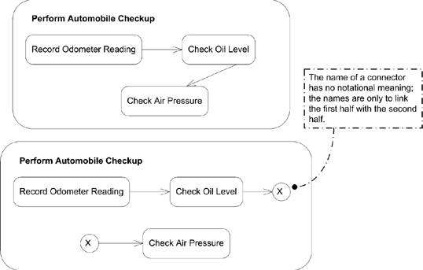

# Diagrame de activitate

Diagramele de activitate surprind execuția și fluxul comportamentului unui sistem. Sunt folosite cu mai multe scopuri, pentru modelarea comportamentului în general, nu doar pentru modelarea software: procese business, procese software, workflow etc. Inițial erau un caz particular al diagramelor de stare; au fost dezvoltate semnificativ în UML 2.0, având la bază o semantică asemănătoare cu cea a [Petri nets](https://en.wikipedia.org/wiki/Petri_net).

Surprind *activități* ce constau în mai multe *acțiuni*. În modelarea software, activitățile reprezintă de regulă un comportament invocat ca rezultat al unei apelări de metodă. În modelarea business-urilor, activitățile pot fi declanșate de evenimente externe (e.g. plasarea unei comenzi) sau interne (un timer care declanșează procesul de payroll la sfârșitul săptămânii de lucru).  

## Activități și acțiuni

*Activitățile* sunt comportamente care pot fi factorizate într-una sau mai multe acțiuni.

O *acțiune* reprezintă un pas (*single step*) al unei activități în care au loc manipulări și procesări de date. Prin *single step* înțelegem că acțiunea nu mai este împărțită în alte fragmente în diagrame (nu sunt neaparăt simple sau atomice).  

#### Exemple

Acțiunile pot fi funcții matematice, apelări ale altor comportamente modelate ca activități, procesoare de date (variabile locale, atribute ale obiectelor etc.). Concret, cu acțiuni putem reprezenta lucruri precum calcularea TVA-ului, trimiterea de informații legate de o comandă unui partener care se ocupă de livrare etc.

Folosim diagrame de activitate pentru a modela comportamentul unui clasificator UML (*contextul* activității). Activitatea are astfel acces la atributele și operațiile clasificatorului, la obiectele aflate în legătură cu acesta, și la eventualii parametri ai unui comportament al clasificatorului cu care activitatea este asociată. 

Activitățile sunt definite cu intenția de a fi refolosite într-o aplicație. Acțiunile sunt însă de regulă specifice și folosite doar în cadrul unei singure activități.

#### Reprezentare

Activitățile sunt reprezentate folosind dreptunghiuri cu colțuri rotunjite în interiorul cărora sunt scrise numele în colțul din stânga-sus. Sub nume putem specifica și parametri implicați în activitate. 

Acțiunile sunt reprezentate similar. 

Putem descrie acțiunile folosind pseudocod sau un limbaj dependent de aplicație.

Activitățile încep cu un nod inițial și se încheie cu noduri finale.

#### Pre/post-condiții

Putem avea pre- și post-condiții care se aplică unei întregi activități. Folosim cuvintele-cheie `<<precondition>>` și `<<postcondition>>` în interiorul activității.

Putem avea și pre- și post-condiții locale ce trebuie să fie adevărate înainte de invocarea sau după terminarea unei acțiuni. Neîndeplinirea condițiilor nu înseamnă neapărat că acțiunea nu poate fi executată; UML nu specifică maparea condițiilor la implementare.   

### Muchii de activitate

Folosim săgeți pentru a lega acțiuni și a arăta fluxul într-o activitate – *control & data flow* de la o acțiune la alta. Folosim săgeți cu linie plină de la o acțiune la următoarea acțiune de executat. Putem folosi etichete pentru a numi săgețile. Acțiunile care nu sunt ordonate prin săgeți se pot executa concurent. 

Folosim muchii de activitate pentru a reprezenta:

- fluxuri de control
- fluxuri de obiecte (data-only): pentru selecție de tokeni, transformări de tokeni, multicast de date

Putem folosi fluxuri de obiecte pentru a selecta anumiți tokeni să treacă de la o activitate la alta specificând un comportament de selecție folosind cuvântul-cheie `<<selection>>` într-o notă atașătă unei săgeți.

Similar, putem asigna comportamente de transformare a datelor care trec de-a lungul unei săgeți (fără side effects), folosind cuvântul-cheie `<<transformation>>`. 

 Putem reprezenta trimiterea de date la mai multe instanțe ale destinatarului folosind o etichetare cu cuvântul-cheie `<<multicast>>` și primirea de date de la mai multe surse cu `<<multireceive>>`. 

#### Reprezentare

Pentru a reprezenta faptul că o acțiune poate accepta mai multe tipuri de inputuri valide, folosim mulțimi de parametri (*parameter sets*) pentru a grupa unul sau mai mulți *pini* de input. Desenăm mulțimile de parametri ca dreptunghiuri în jurul pinilor.

Pentru a simplifica diagramele de activitate, putem împărți muchiile folosind *conectori*. 

## Tokeni

În UML, modelăm trecerea informației de la o acțiune la alta prin *tokeni*. Un token poate reprezenta date reale, un obiect, un punct de control etc. O acțiune are de regulă o mulțime de inputuri necesare și nu începe până inputurile nu sunt îndeplinite. Similar, când se încheie o acțiune, aceasta generează un output care poate declanșa alte acțiuni. Inputurile și outputurile acțiunilor sunt reprezentate ca tokeni.

O muchie de activitate poate avea ponderi asociate care indică câți tokeni trebuie să fie disponibili înainte ca aceștia să fie prezentați acțiunii țintă. Reprezentăm ponderile cu cuvântul-cheie `{weight = ...}`. Dacă ponderea are valoarea `null`, atunci tokenii trebuie trimiși acțiunii destinație imediat ce devin disponibili.   

Muchiile pot avea și condiții de gardă care trebuie testate pentru tokeni. Scriem condițiile ca expresii booleene între `[]`. Dacă condiția este falsă pentru un token, tokenul este distrus. Dacă condiția este adevărată, tokenul devine disponibil pentru a fi consumat de acțiunea următoare. Dacă există o pondere asociată muchiei, mai întâi se așteaptă acumularea numărului necesar de tokeni, apoi se verifică condiția de gardă. Se testează individual fiecare token, fiind eliminați aceia care nu satisfac condiția. 

## Noduri de activitate

Tipuri de noduri de activitate folosite pentru a modela tipuri diferite de fluxuri de informație:

- nod parametru -- reprezentarea trimiterii de date unei activități
- nod obiect -- reprezentarea datelor complexe
- nod control -- direcționarea fluxului într-o diagramă de activitate

#### Noduri parametru

Reprezentarea parametrilor pentru o activitate sau a outputului unei activități executate ca dreptunghiuri desenate pe conturul unei activități, conținând numele sau descrierea parametrului. Nodurile parametru de input au muchii către prima acțiune a activității, iar cele de output de la acțiunea finală.

#### Noduri obiect

Pentru reprezentarea datelor cu structură complexă. Surprind instanțe ale unui clasificator, într-o anumită stare. Folosim dreptunghiuri ce conțin numele nodului (adesea, tipul de date reprezentat de nod). 

#### Pini

Pinii sunt o notație pentru abrevierea inputului și outputului unei acțiuni. Folosim dreptunghiuri mici etichetate atașate unei acțiuni.

 

Dacă outputul unie acțiuni are legătură cu o excepție (condiție de eroare), folosim un pin de excepție (adăugăm un triunghi mic). 

 

#### Noduri de control

Activitățile pot include noduri de control ce reprezintă luarea de decizii, concurența și sincronizarea:

- noduri inițiale -- punctul de start al unei activități; nu există săgeți spre el. Pot exista mai multe noduri inițiale pentru o activitate, câte unul pentru fiecare flux de execuție

- noduri de decizie -- noduri pentru alegerea unui flux de output pe baza unei expresii boolene. Reprezentate prin romburi și etichete cu condițiile de gardă scrise între `[]`. Trebuie să avem grijă la race conditions, alegând condiții de gardă mutual exclusive. Putem specifica funcționalități care să fie executate la trecerea printr-un nod de decizie (fără efecte secundare)

 
 

- noduri de unire (merge) -- aduce la un loc fluxuri alternative într-un singur flux output (nu sincronizează fluxuri concurente; doar ia tokenii aduși de săgețile multiple și îi face disponibili săgeții ce iese din nod)

 

- noduri de fork -- împart fluxul curent dintr-o activitate în mai multe fluxuri concurente; datele care ajung la un nod de fork sunt copiate pentru fiecare săgeată ce iese din nod

 

- noduri de join -- opusul nodurilor de fork; sincronizează mai multe fluxuri ale unei activități într-un singur flux de execuție

 

- noduri finale -- de activitate (termină întreaga activitate; reprezentate ca buline încercuite) și de flux (încheie doar o cale/un flux; reprezentate ca cercuri cu un X)

### Partiții

Folosim partiții pentru a indica cine/ce este responsabil pentru o mulțime de acțiuni dintr-o diagramă de activitate. Le reprezentăm prin zone delimitate de linii verticale sau orizontale (*swimlanes*), cu numele scris în dreptunghiuri la capătul lor (sau scriind numele partiției în paranteze deasupra numelui nodului). 

 

### Bucle 

Un nod buclă e folosit pentru a modela cicluri și are 3 subregiuni: setup, body, test. Subregiunea test trebuie evaluată înainte și după evaluarea regiunii body. Setupul se execută o singură dată, la intrarea în buclă.  

 

## Extra reading

- gestiunea excepțiilor
- expansion regions 
- streaming
- activități ce pot fi întrerupte 
- noduri buffer și de stocare de date

## Exercițiu 

Modelarea unui tonomat de cafea (coffee machine) folosind diagrame de activitate. 

Cerințe:

- tonomatul dă rest
- oferă mai multe tipuri de cafea și permite selectarea cantității de zahăr

## Cu ce desenăm diagrame?

1. [Mermaid](http://mermaid.js.org/), 4 Github, a la Markdown.
2. [Lucidchart](https://www.lucidchart.com)
3. [app.diagrams](https://app.diagrams.net/)
4. [Visual Paradigm](https://online.visual-paradigm.com/diagrams/solutions/free-class-diagram-tool/)

## Bibliografie

 - *UML 2.0 in a Nutshell*, Dan Pilone, Neil Pitman - Chapter 9, Activity Diagrams
 - *Using UML*, Perdita Stevens, Rob Pooley - Chapter 11, Essentials of state and activity diagrams & Chapter 12, More on state diagrams
