# Diagrame de interacțiune (secvență)

Diagramele de interacțiune surprind comunicarea între obiecte, nu neapărat manipularea datelor asociată comunicării. Ele pun accentul pe mesajele propriu-zise trimise de obiecte și cum aceste mesaje se compun în funcționalități. Dacă diagramele structurale arată cum obiectele se compun pentru a îndeplini o cerință de sistem, diagramele de interacțiune arată precis *cum* realizează obiectele acest lucru. 

Diagramele de interacțiune sunt deținute de elemente ale sistemului. De exemplu, o diagramă de secvență asociată unui subsistem poate arăta cum subsistemul realizează un serviciu pe care îl oferă în interfața sa publică. Asociem o diagramă cu un element al sistemului atașând o notă ce face referire la diagramă.

Există mai multe notații disponibile pentru detalierea unei interacțiuni: diagrame de secvență, diagrame de comunicare, diagrame *timing*, tabele de interacțiune, *interaction overviews*. Cea mai comună notație e cea a [diagramelor de secvență](https://mermaid.js.org/syntax/sequenceDiagram.html).

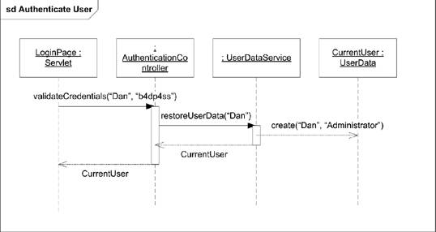

## Participanți

Participanții la o interacțiune sunt reprezentați ca dreptunghiuri din care pornește o linie punctată denumită *lifeline*, ce arată cât timp există un obiect. 

Numele unui participant se scrie folosind notația:

`object_name [ selector ] : class_name ref decomposition`

- `object_name`: numele instanței implicate în interacțiune
- `selector`: opțional; pentru elemente multivaluate
- `class_name`: numele tipului participantului
- `decomposition`: optional; referință la o altă diagramă de interacțiune ce detaliază cum procesează participantul mesajele pe care le primește

Distrugerea unui participant este reprezentată printr-un simbol de `stop`, sub care linia punctată nu mai continuă.

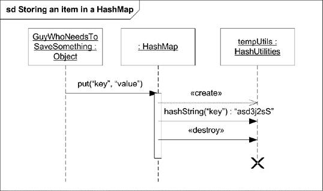

## Mesaje

Principalul scop al diagramelor de interacțiune este reprezentarea comunicării dintre lifelines. Comunicarea se poate face sub mai multe forme: apeluri de metode, trimiterea unui semnal, crearea unei instanțe, distrugerea unui obiect etc. Toate acestea sunt denumite generic *mesaje*. 

Un mesaj specifică tipul de comunicare, expeditorul și destinatarul. Cel mai adesea, prin mesaje reprezentăm apeluri de metode între două obiecte. Atunci, putem nota parametrii trimiși metodei în sintaxa mesajului: atribute ale obiectului ce trimite mesajul, constante, valori simbolice (expresii care arată care sunt valorile admise), parametri expliciți ai interacțiunii, atribute ale clasei ce deține interacțiunea.  

Sintaxa unui mesaj:
`attribute = signal_or_operation_name (arguments ) : return_value`

Un mesaj este reprezentat grafic ca o săgeată cu linie continuă de la lifeline-ul expeditorului la lifeline-ul destinatarului. Dacă mesajul este asincron (callerul nu este blocat în timp ce așteaptă procesarea mesajului de către destinatar), se folosește un capăt de săgeată deschis (open). 

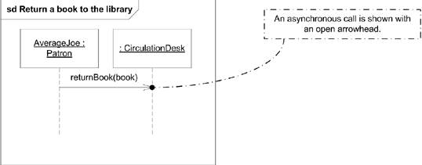

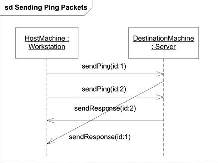

### Crearea de obiecte

Dacă un mesaj reprezintă crearea unui obiect, folosim o linie punctată, cu un cap de săgeată deschis spre lifeline-ul obiectului nou-creat. Putem sublinia momentul creării obiectului prin plasarea dreptunghiului participantului în dreptul mesajului.

### Tipuri speciale de mesaje

UML definește două tipuri de mesaje speciale: 

- mesaje pierdute: mesaje trimise dar care nu ajung la destinație
- mesaje găsite: mesaje care sunt primite de un obiect, dar expeditorul este necunoscut. Utile pentru modelarea unui mecanism de gestiune a excepțiilor: trimiterea excepției este irelevantă pentru mecanism în sine, o putem modela ca un mesaj găsit. 

Reprezentăm mesajele pierdute/găsite folosind discuri în rolul destinatarului/expeditorului.

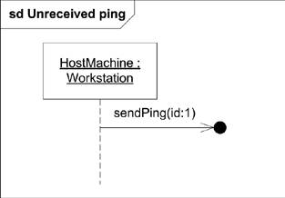

## Ocurențe de execuție

Aratăm că un obiect este implicat în execuția unui tip de acțiune (apelare de metodă) pentru o durată de timp folosind *ocurențe de execuție* (focus control/execution occurrencs). Acestea se reprezintă folosind dreptunghiuri de-a lungul unui lifeline. 

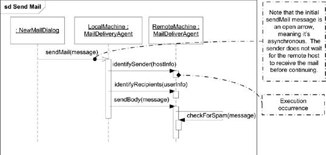

### Invarianți de stare

Putem plasa etichete de-a lungul unui lifeline pentru a specifica condiții ce trebuie să fie adevărate pentru ca restul interacțiunii să fie validă. Condițiile se numesc invarianți de stare și sunt de regulă expresii booleene, dar putem folosi și stări UML. Le scriem între acolade `{}` pe lifeline-ul obiectului pe care dorim să îl verificăm.

### Ocurențe de evenimente

 Ocurențele de evenimente sunt cele mai mici elemente din diagramele de interacțiune; reprezintă momente în timp în care se întâmplă ceva (e.g. trimiterea și primirea de mesaje); acțiuni asociate unui obiect. 

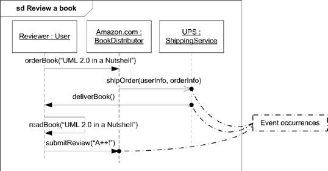

*Trace*-urile sunt secvențe de ocurențe de evenimente. Diagramele permit combinarea de fragmente astfel încât ocurențele să se întrepătrundă. 

## Fragmente combinate

Uneori, o secvență de ocurențe de evenimente are constrângeri sau proprietăți speciale. De exemplu, o zonă critică din interacțiune, în care o mulțime de apeluri de metode trebuie să se execute atomic, sau o buclă care iterează peste o colecție. Aceste părți mai mici ale interacțiunii se numesc în UML *fragmente*. 

Fragmentele de interacțiune pot avea condiții de gardă care specifică când sunt valide (pot fi executate), precum în condițiile `if-then`. Fragmentele pot fi adăugate în containere numite *fragmente combinate*. Acestea sunt formate dintr-un operator de interacțiune și unul sau mai multe fragmente. Sunt reprezentate prin dreptunghiuri cu un pentagon în colțul din stânga sus în care este trecut operatorul.

### Operatori de interacțiune

- alternative: `alt` 

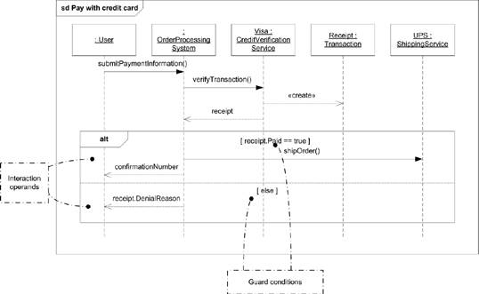

- opțiune: `opt`

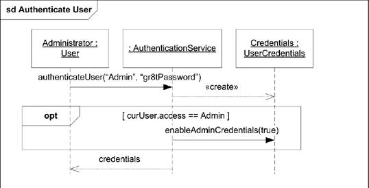

- întrerupere: `break`

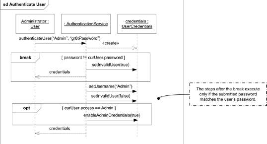

- paralelism: `par`

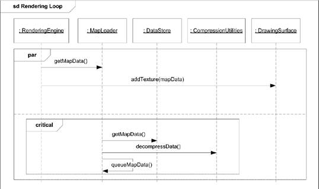

- buclă: `loop`

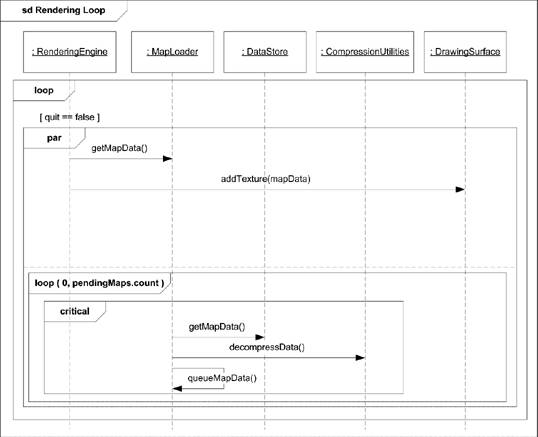

## Extra reading
Ocurențe de interacțiune (copierea unei interacțiuni în alta), descompunere, continuări (definirea mai multor ramuri ale unei interacțiuni alternative în afara alternativei respective).   

## Exercițiu 

Modelarea programării unui eveniment (nerd night out) folosind diagrame de secvență. 

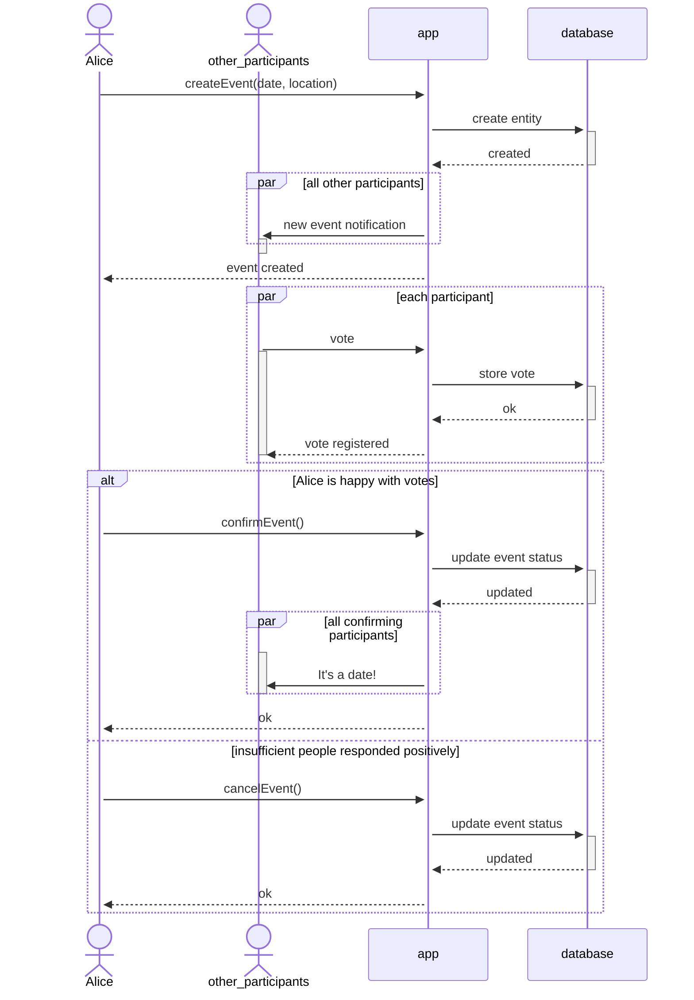

## Exercițiu 

Modelarea unui flux de code versioning folosind diagrame de secvență. 

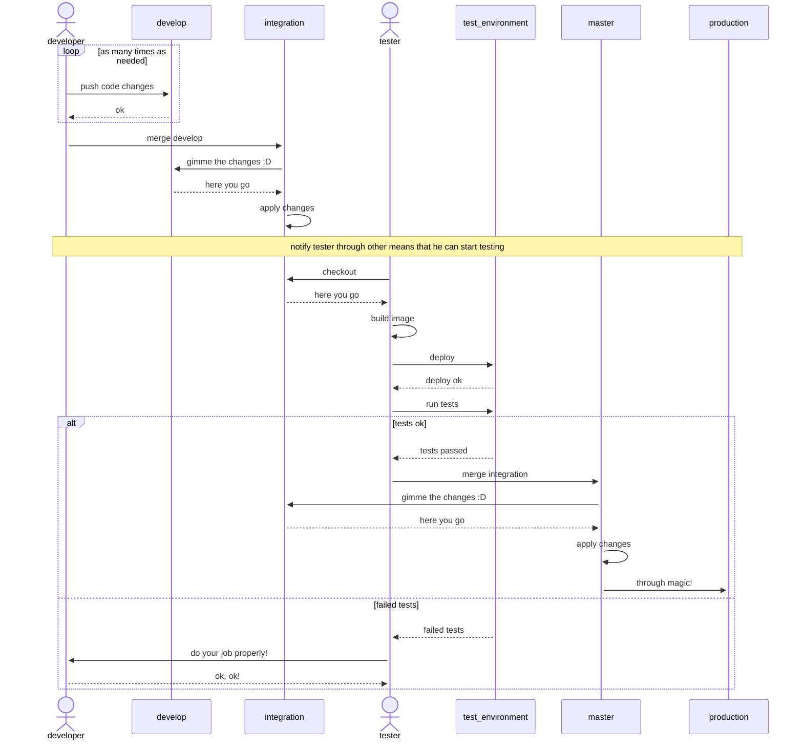

## Cu ce desenăm diagrame?

1. [Mermaid](http://mermaid.js.org/), 4 Github, a la Markdown.
2. [Lucidchart](https://www.lucidchart.com)
3. [app.diagrams](https://app.diagrams.net/)
4. [Visual Paradigm](https://online.visual-paradigm.com/diagrams/solutions/free-class-diagram-tool/)

## Bibliografie

 - *UML 2.0 in a Nutshell*, Dan Pilone, Neil Pitman - Chapter 10, Interaction Diagrams
 - *Using UML*, Perdita Stevens, Rob Pooley - Chapter 9, Essentials of interaction diagrams & Chapter 10, More on interaction diagrams
