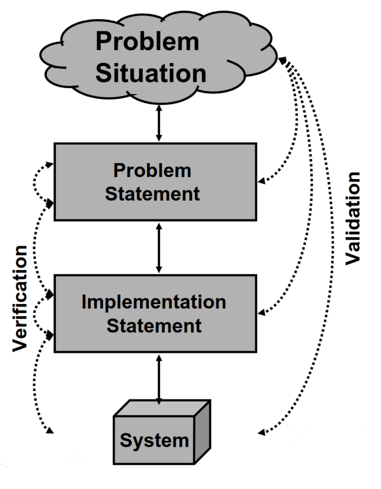
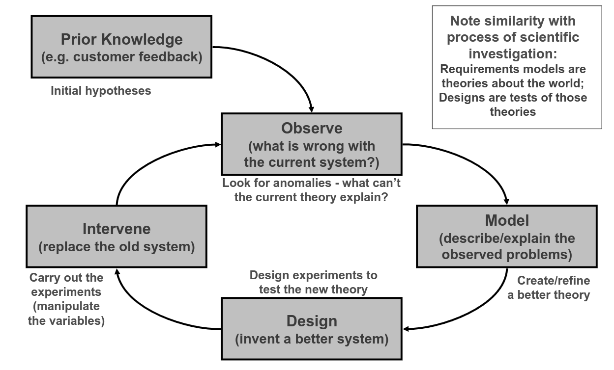
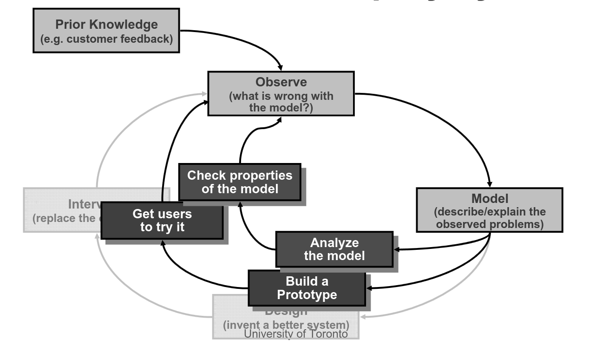
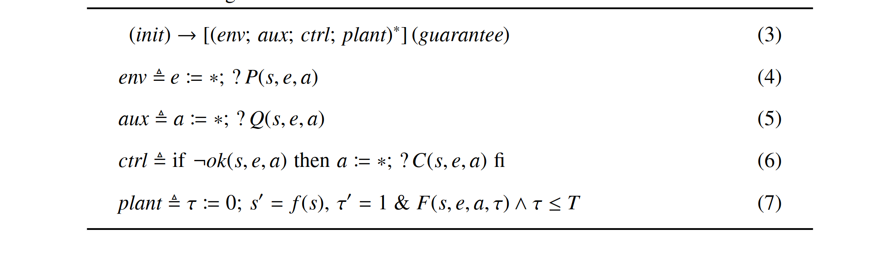

# Evaluarea și testarea modelelor

## Verificarea & validarea sistemelor software

Quality review: *"insure that the project is free from failures and meets its user's expectations/requirements"*

#### Obiective

- corectitudine: produsul nu are erori
- consistență: produsul este consistent (cu sine și cu alte produse relevante)
- necesitate: orice componentă a produsului este necesară
- suficiență: produsul este complet
- calitate: produsul satisface cerințele de calitate impuse

## Verificare 

Verificarea este procesul prin care ne asigurăm că am dezvoltat un produs în mod corect, adică că îndeplinește cerințele stabilite.

*"Are we building the system right?"*

– îndeplinește designul specificația? 

– îndeplinește implementarea specificația? 

– face sistemul livrat ceea ce ne-am angajat să facă?

– sunt modelele de cerințe consistente unele cu altele? 

Verificarea implică întotdeauna testarea unui lucru (produsul) față de un altul (specificația). Ce reprezintă produsul și ce reprezintă specificația variază de la caz la caz. Cel mai adesea, testăm cod (the running system) față de specificația cerințelor. 

Pentru verificarea din contextul dezvoltării UML putem împărți verificarea în mai multe etape. Verificăm că:

1. use case-urile din modelul UML satisfac cerințele din specificația de cerințe
2. clasele pot genera acele cazuri de utilizare
3. codul corespunde claselor din design 

#### \+ Alte *sanity checks* implicite, evidente:

- codul se compilează, rulează fără erori 
- modelele UML produse în proiect sunt corecte sintactic și sunt consistente (întotdeauna poate exista un program descris de model)

Pentru verificare acestor *sanity checks* folosim adesea testarea de cod. În afară de testare, avem la dispoziție metode cu un grad de formalitate variat:

 - informal: un dezvoltator poate citi două modele, documente, fișiere sursă și verifica corespondența între ele 
- formal: putem produce o demonstrație  că două modele, documente, fișire sursă corespund; rar în practică, are sens doar dacă lucrurile comparate sunt formal înțelese, cu semantică bine-definită (UML nu are semantică formală; o verificare formală a unor modele UML nu este posibilă în principiu). Time consuming – în practică doar pentru *safety-critical systems*
- semi-formal: compilarea codului; folosirea unor unelte de modelare UML automată (generare de cod din modele UML și viceversa) pentru generarea de modele corecte sintactic și verificarea consistenței dintre modele UML diferite 
- human-tool: îmbunătățiri la verificarea manuală a consistenței modelelor de către un dezvoltator – checklists & reviews

## Validare

Validarea este procesul prin care ne asigurăm că am dezvoltat produsul potrivit, adică produsul este potrivit scopului, chiar și în privința unor aspecte ce nu au fost surprinse de cerințele de sistem impuse. 

*"Are we building the right system?"*

- surprinde problem statementul cu acuratețe problema reală? 
- am luat în calcul nevoile tuturor stakeholderilor?

Validarea este mai dificilă decât verificarea pentru că nu știm exact ce căutăm de la început: căutăm orice ar putea face produsul mai puțin util pentru client decât ar trebui să fie. 
 
Pentru o validare eficientă e întotdeauna nevoie de implicarea clientului.
 
#### Usability 

Un criteriu important în validarea unui sistem. Un sistem de calitate trebuie nu doar să asigure funcționalitatea dorită, ci și să o asigure în așa fel încât utilizatorii să o poată folosi eficient, cu ușurință. 

## Analiză ciclică

### Criterii V&V

- Proprietăți specifice domeniului (*domain properties*): lucruri în domeniul de aplicație ce sunt adevărate în general
- Cerințe (*requirements*): lucruri din domeniul de aplicație pe care dorim să le îndeplinim
- Specificație: descrierea a comportamentului pe care trebuie să îl aibă sistemul pentru a îndeplini cerințele 

Criterii de verificare:
- un program ce rulează pe un sistem hardware anume satisface o specificație 
- o specificație, date fiind niște proprietăți ale domeniului, satisface cerințele

Criterii de validare: 

- am descoperit și înțeles (interpretat corect) toate cerințele importante?
- am descoperit și înțeles (interpretat corect) toate proprietățile de domeniu relevante? 

### Exemplu V&V

- Cerința C: "Reverse thrust shall only be enabled when the aircraft is moving on the runway"

- Proprietăți specifice domeniului P:
  - "Wheel pulses on if and only if wheels turning"
  - "Wheels turning if and only if moving on runway"

- Specificația S: "Reverse thrust enabled if and only if wheel pulses on"

- Validare:
  - Sunt presupunerile noastre, P, despre domeniu corecte? Am uitat vreo proprietate? 
  - Sunt cerințele C ceea ce necesită sistemul cu adevărat? Am uitat vreo cerință?

- Verificare:
  - Implementează corect software-ul F, ce rulează pe calculatorul de zbor Z, specificația S?
  - Satisface S, în contextul presupunerilor P, cerința C?

### Activități de V&V

- Reviewuri: walkthroughs (tehnică de dezvoltare, adesea informală), inspecții (Fagan, unealtă de process management), management reviews (preliminary design review - PDR, critical design review - CDR etc.)
- Testare software
- Metode formale - folosirea de instrumente matematice pentru demonstrarea consistenței cerințelor: animarea modelului pe exemple mici; state exploration (model-checking), what-if reasoning folosind limbaje (logică) dedicate
 - Consistency checking (poate fi realizată formal): asigurarea consistenței între modele
- Prototiparea: prezentarea stakeholderului a unui prototip pentru confirmarea comportamentului dorit; throwaway vs evolutionary prototypes
- Requirements Tracing: tracingul fiecărei cerințe din sistem de la implementare la origine

### Extra -- metode formale

- [Modele UML executabile](https://link.springer.com/article/10.1007/s10270-018-0675-4)
- [Evaluarea corectitudinii comportamentale a unor modele UML](https://www.researchgate.net/publication/289924224_Evaluating_behavioral_correctness_of_a_set_of_UML_models)
- [Model Checking for UML Use Cases](https://link.springer.com/chapter/10.1007/978-3-540-70561-1_17)
- [Cyber-Physical Systems](https://symbolaris.com/course/lfcps.html)

## Bibliografie

 - *Using UML*, Perdita Stevens, Rob Pooley - Chapter 19, Product quality: verification, validation, testing
