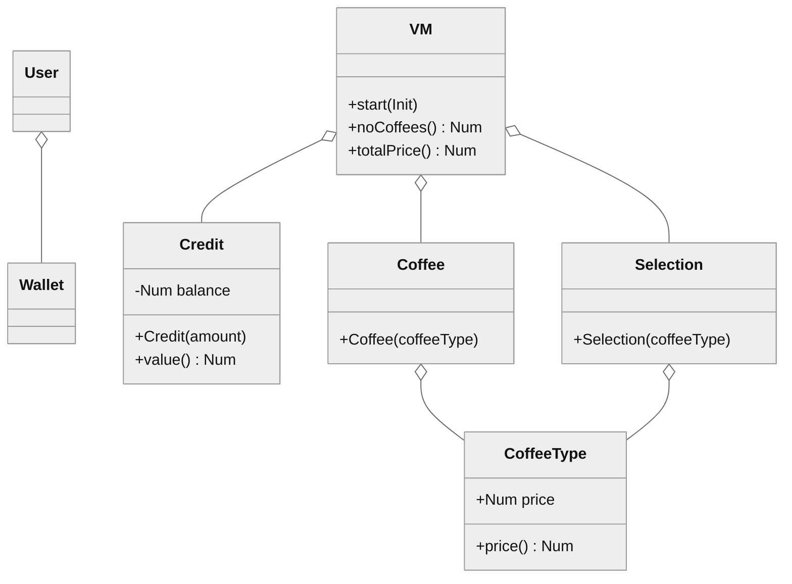
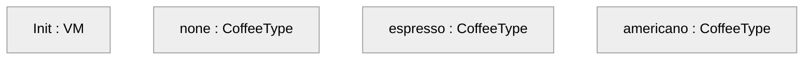
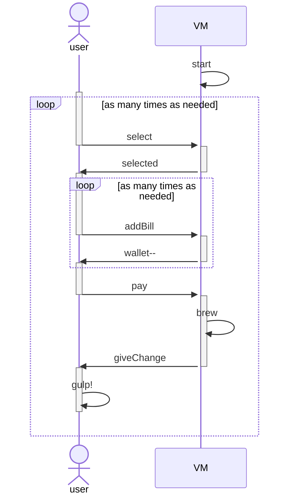

# Specificații formale

[Specificații formale](https://en.wikipedia.org/wiki/Formal_specification)

## Specificații algebrice

[Specificații algebrice](https://en.wikipedia.org/wiki/Algebraic_specification)

- [OBJ](https://en.wikipedia.org/wiki/OBJ_(programming_language))
- [Maude](http://maude.cs.illinois.edu/w/index.php/The_Maude_System)
- [CASL](https://www.informatik.uni-bremen.de/agbkb/forschung/formal_methods/CoFI/CASL/casl.pdf)
- [K framework](https://kframework.org/)

### Exemplu: Tonomat de cafea

Diagrame UML de clasă și de secvență

