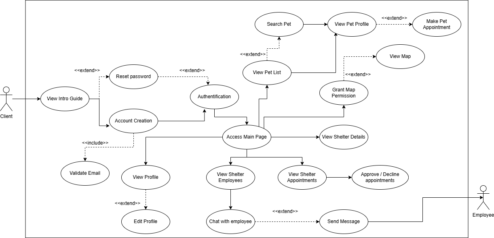
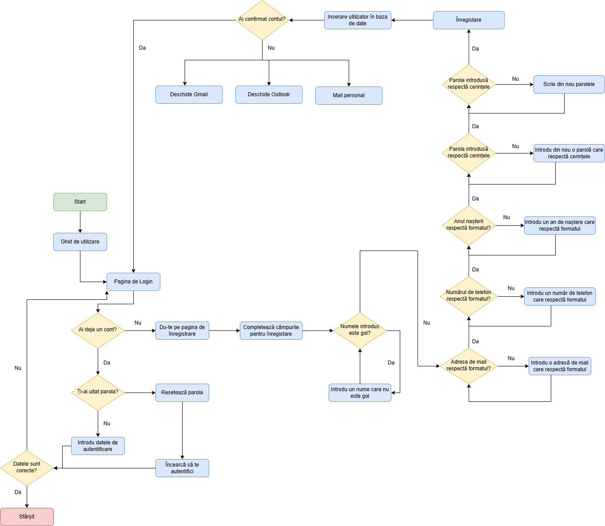
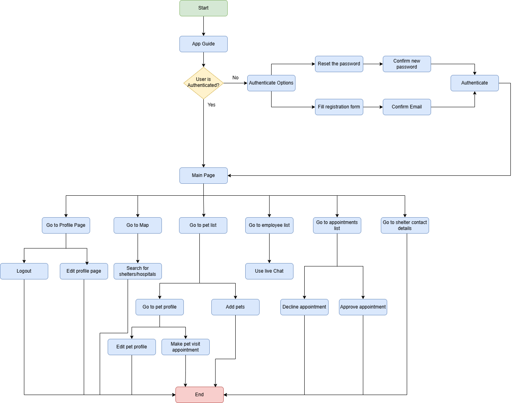
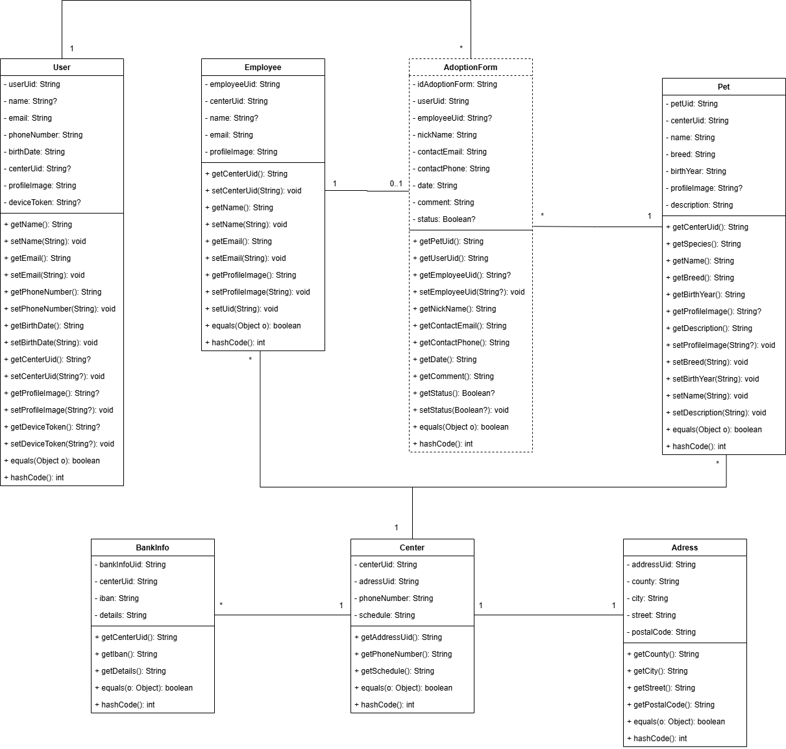
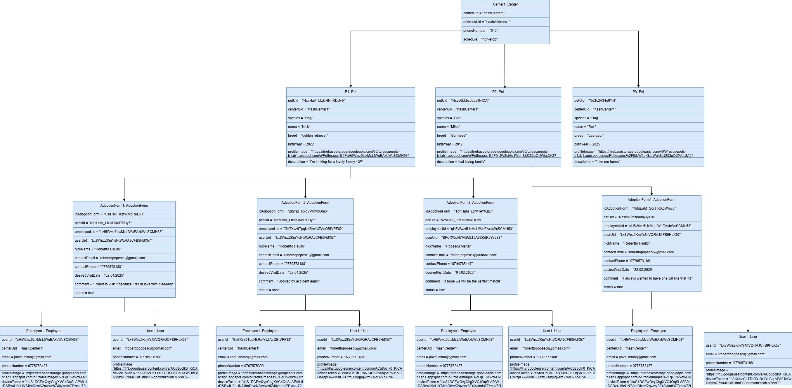
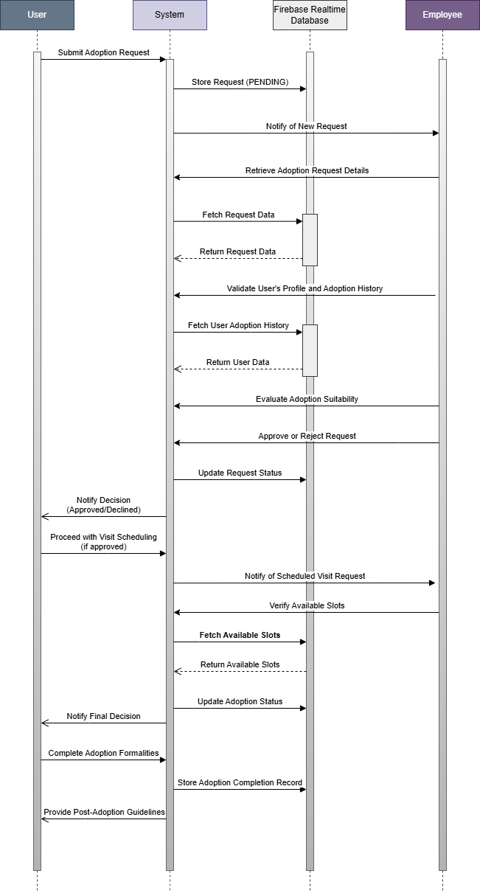

# RescuePets

## Obiectiv

Trăim într-o eră digitală în continuă evoluție, în care găsirea unui animal de companie poate deveni o provocare reală. Potrivit statisticilor, aproximativ 400 de milioane de animale fără stăpân se confruntă cu situația suprapopulării, iar anual aproape 3 milioane dintre acestea sunt eutanasiate în adăposturi, din cauza dificultății de a găsi un cămin.  
Din dorința de a contribui la reducerea acestor probleme, am creat RescuePets care își propune să faciliteze procesul de adopție printr-o aplicație mobilă sigură, ușor de utilizat și interactivă. Astfel, utilizatorii pot comunica în timp real cu angajații centrelor, pot explora profilurile detaliate ale animalelor și își pot programa vizitele la adăposturi, totul într-un mod structurat și transparent. ❤️🐕

Proiectul pune accent pe un design modern și prietenos (Material Design), pe securitatea datelor (stocarea parolelor prin hashing și autentificare pe bază de roluri) și pe funcționalități inovatoare (chat în timp real, managementul vizitelor, baze de date locale și online, suport offline). Prin aceste abordări, RescuePets vizează îmbunătățirea semnificativă a șanselor de adopție și, implicit, a calității vieții atât pentru animale, cât și pentru iubitorii acestora.

## Cerințe Funcționale

| **Cerință**                                                                                                       | **Justificare**                                                                                                                                          |
|-------------------------------------------------------------------------------------------------------------------|-----------------------------------------------------------------------------------------------------------------------------------------------------------|
| Trebuie să pot crea un cont (înregistrare)                                                                        | Pentru a accesa funcționalitățile platformei.                                                                                                             |
| Trebuie să mă pot autentifica și să îmi pot reseta parola                                                         | Pentru a-mi menține securizat contul și a putea recupera accesul dacă am uitat parola.                                                                     |
| Trebuie să pot autentifica/inregistra cu contul de Google                                                          | Pentru a facilita accesul rapid și convenabil, folosind serviciile Google.                                                                                 |
| Trebuie să mă pot deloga de pe cont                                                                                | Pentru a asigura securitatea contului meu.                                                                                                                |
| Trebuie să pot vizualiza și actualiza profilul meu (nume, email, telefon, poză etc.)                              | Pentru a menține informațiile mele personale corecte și actualizate.                                                                                      |
| Trebuie să pot căuta și vizualiza detalii despre animalele disponibile (specie, rasă, vârstă, descriere, imagini) | Pentru a găsi mai ușor animalul potrivit nevoilor și preferințelor mele.                                                                                  |
| Trebuie să pot trimite cereri de programare la centrul de animale (pentru vizită/adopție)                          | Pentru a stabili data și ora vizitei în adăpost și a facilita procesul de adopție.                                                                        |
| Trebuie să pot vedea statusul cererilor de programare (în așteptare, aprobat, respins)                             | Pentru a fi la curent cu evoluția și rezultatul solicitărilor mele.                                                                                       |
| Trebuie să pot comunica în timp real cu un angajat (chat/asistent virtual)                                         | Pentru a primi informații și sfaturi rapide despre procesul de adopție sau îngrijirea animalelor.                                                         |
| Trebuie să pot trimite atașamente (poze, documente) în chat către un angajat)                                      | Pentru a facilita comunicarea și a oferi documente relevante în procesul de adopție.                                                                       |
| Trebuie să pot șterge mesaje din chat (only for me, delete for everyone)                                           | Pentru a gestiona istoricul conversațiilor în funcție de preferințele mele.                                                                                |
| Trebuie să pot primi notificări despre evenimente majore (primire mesaj chat, adopție, aprobare cerere, respingere cerere)            | Pentru a fi informat în timp util și a nu pierde informații importante.                                                                 |
| Trebuie să pot accesa harta și să îmi văd locația în timp real                                                    | Pentru a găsi mai ușor centrele de adopție și a mă orienta.                                                                                                  |
| Trebuie să pot posta anunțuri (în cazul în care doresc să dau spre adopție un animal)                              | Pentru a facilita găsirea unui nou stăpân și a oferi vizibilitate anunțurilor mele.                                                                        |
| Trebuie să pot vizualiza și filtra animalele după numele acestora, rasă, specie, anul nașterii                          | Pentru a găsi cât mai rapid ce animale satisfac dorințele mele.                                                                                        |
| Trebuie să pot încărca și actualiza imagini cu animalele (doar pentru angajați)                                   | Pentru a menține informațiile din platformă la zi și a prezenta animalele cât mai atractiv.                                                               |
| Trebuie să pot aproba sau respinge cererile de programare (doar pentru angajați)                                   | Pentru a organiza vizitele și a valida cererile de adopție în mod controlat.                                                                              |
| Trebuie să pot vedea istoricul cererilor trimise (utilizator) sau istoricul cererilor primite (angajat)           | Pentru a urmări evoluția adopțiilor și a ține evidența programărilor.                                                                                     |
| Trebuie să pot vedea informațiile de contact și programul centrului de animale                                    | Pentru a putea contacta centrul și a ști când este disponibil.                                                                                            |
| Trebuie să pot dona sau sponsoriza un centru de animale                                                           | Pentru a susține financiar adăpostul și a contribui la îngrijirea animalelor fără stăpân.                                                                  |
| Trebuie să am un tab cu tutorial video al aplicației                                                              | Pentru a învăța mai ușor cum se folosește aplicația și a vedea funcționalitățile în acțiune.                                                              |
| Trebuie să pot da share aplicației către prietenii mei                                                            | Pentru ca aceștia să o poată găsi mai ușor și să o instaleze.                                                                                            |

---

## Cerințe Non-Funcționale

- **Interfață și UX**  
  Aplicația trebuie să fie intuitivă și ușor de utilizat, cu o organizare clară a elementelor și aliniată la principiile Material Design.

- **Performanță**  
  Paginile și funcționalitățile principale (ex.: căutare animale, vizualizare profil) trebuie să se încarce în câteva secunde pentru a nu afecta experiența utilizatorilor.

- **Scalabilitate**  
  Arhitectura (MVVM + Clean Architecture) trebuie să permită extinderea ușoară a funcționalităților și gestionarea unui număr mare de utilizatori/conexiuni simultane.

- **Securitate**  
  Parolele utilizatorilor trebuie stocate prin algoritmi de hash, iar accesul la date și funcționalități trebuie să fie controlat prin roluri (utilizator simplu/angajat).

- **Disponibilitate și Reziliență**  
  Aplicația trebuie să funcționeze și în modul offline, folosind o bază de date locală (Room) care să mențină o copie a datelor din Firebase.

- **Compatibilitate**  
  Aplicația trebuie să ruleze pe dispozitive cu sistem de operare Android, începând de la API 26 (Android 8.1) și până la versiunile recente (Android 14).

- **Mentenabilitate**  
  Codul trebuie să fie organizat pe principii solide (MVVM, repository pattern, dependency injection etc.) pentru a facilita întreținerea și actualizările ulterioare.

## Demo al aplicației
Puteți vizualiza live demo-ul aplicației aici: [Demo RescuePets](https://youtu.be/vRH2wFSKh0k?si=2nDVV-J5v8W1W_HB)

Sau dacă apasați pe imaginea de mai jos:

[](https://youtu.be/vRH2wFSKh0k?si=2nDVV-J5v8W1W_HB)

## Implementarea backendului
Pentru a implementa design pattern-ul **MVVM – Model-View-ViewModel with Clean Architecture**, backendul aplicației RescuePets a fost structurat în trei layere distincte, ceea ce asigură testabilitatea, decuplarea componentelor și scalabilitatea codului.

### Structura Backendului

- **Data**  
  - *Subpachetul `pojo`*: conține entitățile definite în diagrama conceptuală.  
  - *Subpachetul `source`*: gestionează logica CRUD pentru baza de date locală (Room) și baza de date online (Firebase) și sincronizarea între ele.

- **Domain**  
  - Responsabil pentru logica aplicației și pentru comunicarea între interfața grafică și bazele de date.  
  - Aici se preia controlul asupra datelor pentru procesare.

- **Presentation**  
  - Conține clasa `RescuePetsApplication`, responsabilă de inițializarea și injectarea dependințelor prin Dagger.

### Sincronizarea Datelor și Operațiile CRUD

- Pentru a facilita comunicarea între baza de date locală (Room) și cea online (Firebase), query-urile de citire sunt incapsulate în obiecte de tip **LiveData**, asigurând actualizări asincrone ale interfeței.
- Clasa `RescuePetsMediator` se ocupă de sincronizarea datelor, fiind instanțiată prin Dagger și utilizând:
  - Un repository local (`RescuePetsLocalRepository`) pentru operațiuni pe baza de date Room.
  - Un worker (`WorkerManager`) care procesează operațiile CRUD pe un fir de execuție separat, folosind o coadă sigură (Thread Safe Queue).

### Managementul Dependințelor

- **Dagger** este utilizat pentru injectarea dependințelor, prin intermediul clasei `RescuePetsDependencyProvider`, care:
  - Inițializează repository-urile, mediatorul și use-case-urile.
  - Utilizează metode marcate cu `@Provides` pentru a organiza și gestiona corect dependențele aplicației.

### Alte Aspecte Tehnice

- Pentru operațiile de inserare (POST) și actualizare (PUT), se generează un UID unic pentru fiecare obiect, asigurând astfel integritatea datelor și prevenind problemele de sincronizare.
- Clasa `RescuePetsPojo` din pachetul **data-pojo** implementează interfața `Serializable` și permite setarea UID-ului după confirmarea operației de POST în Firebase.
- Clasa `PetUseCase` oferă o interfață abstractă pentru manipularea datelor, contribuind la modularitatea și organizarea codului.

## Tehnologii
Am implementat aplicație mobile folosind următoarele tehnologii:
- Android – Platforma principală pentru aplicația mobilă ✔️
- Firebase – Gestionarea autentificării, bazei de date și stocării în cloud ✔️
- Room – ORM local pentru gestionarea bazei de date offline ✔️
- Java – Limbajul principal utilizat pentru dezvoltarea aplicației ✔️
- Gradle cu Kotlin DSL – Gestionarea dependențelor și build-ului aplicației ✔️

## Diagrama bazei de date
### Diagrama Entitate-Relație (ERD)


### Diagrama Conceptuală


## Diagrama Use-Case
Diagrama generală a proiectului



## Diagrama de flux
### Diagrama de flux pentru procesul de autentificare, înregistrare, resetare parolă
Pentru a înțelege mai bine fluxul de lucru al aplicației am realizat diagramele de flux 
pentru procesul de autentificare, înregistrare și resetare a parole (Figura 3.7), precum și cel 
general de utilizare al aplicației



### Diagrama de flux general al aplicației


## Diagrama de clase
Diagrama de clase pentru modelele din baza de date reprezintă structura entităților, atributele acestora și relațiile dintre ele. Fiecare clasă corespunde unui tabel din baza de date, având atribute (coloane) și asocieri (chei externe). Aceasta ajută la înțelegerea arhitecturii bazei de date și a conexiunilor dintre entități.



## Diagrama de obiecte
Diagrama de obiecte este o instanțiere a diagramei de clase, reprezentând obiectele concrete și valorile atributelor lor la un moment dat. Aceasta oferă o imagine detaliată a modului în care datele sunt stocate și interconectate în timpul execuției aplicației.
Pe baza diagramei pe care ai furnizat-o, diagrama de obiecte prezintă instanțele efective ale entităților precum Center, Pet, User, Employee și AdoptionForm, cu valori specifice pentru fiecare atribut. Obiectele sunt conectate între ele conform relațiilor definite în diagrama de clase, de exemplu:
- Un centru de adopție (Center) are mai multe animale (Pet) asociate.
- Un utilizator (User) și un angajat (Employee) sunt legați de formularele de adopție (AdoptionForm).
- Fiecare formular de adopție conține referințe la animalul adoptat, utilizatorul care adoptă și angajatul care procesează cererea.



## Sequence Diagram
Diagrama de secvență prezintă pașii procesului de adopție, evidențiind interacțiunea dintre utilizator, sistem, baza de date și angajați. Utilizatorul trimite o cerere, sistemul o stochează și notifică angajatul, care verifică datele și decide aprobarea sau respingerea. Dacă este aprobată, se programează o vizită, iar după finalizare, adopția este completată și utilizatorul primește instrucțiuni post-adopție.



## Design Patterns

### Repository Pattern
Repository-urile sunt clase abstracte din pachetul „domain”, care asigură proprietatea 
de scalabilitate a aplicației. Metodele definite aici sunt folosite atât de worker, cât și de 
mediator, care descarcă datele din baza de date online și le inserează în cea locală.

Implementarea:
```java
public abstract class RescuePetsLocalRepository {
    protected Context mContext;

    protected RescuePetsLocalRepository( Context context ) {
        super();
        this.mContext = context;
    }

    protected abstract void insertAddress( Address address );

    protected abstract void insertCenter( Center center );

    protected abstract void insertBankInfo( BankInfo bankInfo );

    protected abstract void insertEmployee( Employee employee );

    protected abstract void insertPet( Pet pet );

    protected abstract void insertUser( User user );

    protected abstract LiveData< Pet > getPet( @NonNull String petUid );

    protected abstract LiveData< Center > getCenter( @NonNull String centerUid );

    protected abstract LiveData< Address > getAddress( @NonNull String addressUid );

    protected abstract LiveData< List< BankInfo > > getBankInfoByCenterUid( @NonNull String centerUid );

    protected abstract void insertAdoptionForm( AdoptionForm adoptionForm );

    protected abstract LiveData< List< Pet > > getAllPets();

    protected abstract LiveData< List< AdoptionForm > > getAllAdoptionForms();

    protected abstract LiveData< List< AdoptionForm > > getAdoptionFormsByUserUid( @NonNull String UserUid );

    protected abstract LiveData< Employee > getEmployee( @NonNull String employeeUid );

    protected abstract LiveData< User > getUser( @NonNull String userUid );

    protected abstract LiveData< AdoptionForm > getAdoptionForm( @NonNull String adoptionFormUid );
}
```

LocalDataSource care implementează metodelete:

```java
public final class LocalDataSource extends RescuePetsLocalRepository {
    final RescuePetsDao rescuePetsDao;

    public LocalDataSource( Context context ) {
        super( context );
        rescuePetsDao = AppDatabase.getAppDatabase( context ).rescuePetsDao();
    }

    @Override
    protected void insertAddress( Address address ) {
        AppDatabase.databaseWriteExecutor.execute( () -> {
            try {
                rescuePetsDao.insertAddress( address );
            } catch ( Exception e ) {
                Timber.e( e );
            }
        } );
    }

    @Override
    protected void insertCenter( Center center ) {
        AppDatabase.databaseWriteExecutor.execute( () -> {
            try {
                rescuePetsDao.insertCenter( center );
            } catch ( Exception e ) {
                Timber.e( e );
            }
        } );
    }

    @Override
    protected void insertBankInfo( BankInfo bankInfo ) {
        AppDatabase.databaseWriteExecutor.execute( () -> {
            try {
                rescuePetsDao.insertBankInfo( bankInfo );
            } catch ( Exception e ) {
                Timber.e( e );
            }
        } );
    }

    @Override
    protected void insertEmployee( Employee employee ) {
        AppDatabase.databaseWriteExecutor.execute( () -> {
            try {
                rescuePetsDao.insertEmployee( employee );
            } catch ( Exception e ) {
                Timber.e( e );
            }
        } );
    }

    @Override
    protected void insertPet( Pet pet ) {
        AppDatabase.databaseWriteExecutor.execute( () -> {
            try {
                rescuePetsDao.insertPet( pet );
            } catch ( Exception e ) {
                Timber.e( e );
            }
        } );
    }

    @Override
    protected void insertAdoptionForm( AdoptionForm adoptionForm ) {
        AppDatabase.databaseWriteExecutor.execute( () -> {
            try {
                rescuePetsDao.insertAdoptionForm( adoptionForm );
            } catch ( Exception e ) {
                Timber.e( e );
            }
        } );
    }

    @Override
    protected void insertUser( User user ) {
        AppDatabase.databaseWriteExecutor.execute( () -> {
            try {
                rescuePetsDao.insertUser( user );
            } catch ( Exception e ) {
                Timber.e( e );
            }
        } );
    }

    @Override
    protected LiveData< List< Pet > > getAllPets() {
        return rescuePetsDao.getAllPets();
    }

    @Override
    protected LiveData< List< AdoptionForm > > getAllAdoptionForms() {
        return rescuePetsDao.getAllAdoptionForms();
    }

    @Override
    protected LiveData< List< BankInfo > > getBankInfoByCenterUid( @NonNull String centerUid ) {
        return rescuePetsDao.getBankInfoByCenterUid( centerUid );
    }

    @Override
    protected LiveData< List< AdoptionForm > > getAdoptionFormsByUserUid( @NonNull String userUid ) {
        return rescuePetsDao.getAdoptionFormsByUserUid( userUid );
    }

    @Override
    protected LiveData< Pet > getPet( @NonNull String petUid ) {
        return rescuePetsDao.getPet( petUid );
    }

    @Override
    protected LiveData< Center > getCenter( @NonNull String centerUid ) {
        return rescuePetsDao.getCenter( centerUid );
    }

    @Override
    protected LiveData< Address > getAddress( @NonNull String addressUid ) {
        return rescuePetsDao.getAddress( addressUid );
    }

    @Override
    protected LiveData< Employee > getEmployee( @NonNull String employeeUid ) {
        return rescuePetsDao.getEmployee( employeeUid );
    }

    @Override
    protected LiveData< User > getUser( @NonNull String userUid ) {
        return rescuePetsDao.getUser( userUid );
    }

    @Override
    protected LiveData< AdoptionForm > getAdoptionForm( @NonNull String adoptionFormUid ) {
        return rescuePetsDao.getAdoptionForm( adoptionFormUid );
    }

    @Dao
    protected interface RescuePetsDao {
        @Query( "SELECT * FROM PET" )
        LiveData< List< Pet > > getAllPets();

        @Query( "SELECT * FROM ADOPTIONFORM" )
        LiveData< List< AdoptionForm > > getAllAdoptionForms();

        @Query( "SELECT * FROM BANKINFO WHERE BANKINFO.centerUid=:centerUid" )
        LiveData< List< BankInfo > > getBankInfoByCenterUid( String centerUid );

        @Query( "SELECT * FROM ADOPTIONFORM WHERE ADOPTIONFORM.userUid=:userUid" )
        LiveData< List< AdoptionForm > > getAdoptionFormsByUserUid( String userUid );

        @Query( "SELECT * FROM PET WHERE PET.uid=:petUid" )
        LiveData< Pet > getPet( String petUid );

        @Query( "SELECT * FROM CENTER WHERE Center.uid=:centerUid" )
        LiveData< Center > getCenter( String centerUid );

        @Query( "SELECT * FROM ADDRESS WHERE Address.uid=:addressUid" )
        LiveData< Address > getAddress( String addressUid );

        @Query( "SELECT * FROM EMPLOYEE WHERE EMPLOYEE.uid=:employeeUid" )
        LiveData< Employee > getEmployee( String employeeUid );

        @Query( "SELECT * FROM User WHERE User.uid=:userUid" )
        LiveData< User > getUser( String userUid );

        @Query( "SELECT * FROM AdoptionForm WHERE AdoptionForm.uid=:adoptionFormUid" )
        LiveData< AdoptionForm > getAdoptionForm( String adoptionFormUid );

        @Insert( onConflict = OnConflictStrategy.REPLACE )
        void insertAddress( Address address );

        @Insert( onConflict = OnConflictStrategy.REPLACE )
        void insertBankInfo( BankInfo bankInfo );

        @Insert( onConflict = OnConflictStrategy.REPLACE )
        void insertCenter( Center center );

        @Insert( onConflict = OnConflictStrategy.REPLACE )
        void insertEmployee( Employee employee );

        @Insert( onConflict = OnConflictStrategy.REPLACE )
        void insertPet( Pet pet );

        @Insert( onConflict = OnConflictStrategy.REPLACE )
        void insertAdoptionForm( AdoptionForm adoptionForm );

        @Insert( onConflict = OnConflictStrategy.REPLACE )
        void insertUser( User user );
    }
}
```

### Singleton Pattern
Am utilizat design pattern-ul Singleton pentru a asigura existența unei singure instanțe a bazei de date locale Room, cu scopul de a economisi resurse și de a menține consistența datelor. În clasa `LocalDataSource`, se obține instanța singleton a clasei `AppDatabase`, iar prin intermediul `RescuePetsDao` sunt efectuate operațiile de inserare și căutare în baza de date.

Acest pattern garantează utilizarea eficientă a resurselor și gestionarea corectă a accesului la baza de date locală, prevenind crearea multiplă a instanței bazei de date și evitând problemele de acces concurent.

Implementarea clasei AppDatabase:

```java
@Database( entities = { User.class, Center.class, Address.class, Employee.class, BankInfo.class, Pet.class, AdoptionForm.class }, version = 1 )
abstract class AppDatabase extends RoomDatabase {
    private static volatile AppDatabase INSTANCE;
    private static final int NUMBER_OF_THREADS = 4;
    protected static final ExecutorService databaseWriteExecutor = Executors.newFixedThreadPool( NUMBER_OF_THREADS );

    AppDatabase() {
        super();
    }

    protected abstract LocalDataSource.RescuePetsDao rescuePetsDao();

    protected static AppDatabase getAppDatabase( final Context context ) {
        synchronized ( AppDatabase.class ) {
            if ( INSTANCE == null ) {
                INSTANCE = Room.databaseBuilder( context.getApplicationContext(),
                                AppDatabase.class,
                                "rescuepets-db" )
                        .build();
            }
            return INSTANCE;
        }
    }
}
```

Implementarea clasei LocalDataSource:

```java
public final class LocalDataSource extends RescuePetsLocalRepository {
    final RescuePetsDao rescuePetsDao;

    public LocalDataSource( Context context ) {
        super( context );
        rescuePetsDao = AppDatabase.getAppDatabase( context ).rescuePetsDao();
    }

    @Override
    protected void insertAddress( Address address ) {
        AppDatabase.databaseWriteExecutor.execute( () -> {
            try {
                rescuePetsDao.insertAddress( address );
            } catch ( Exception e ) {
                Timber.e( e );
            }
        } );
    }
  // restul codului..
}
```

### Dependency Injection - Dagger Pattern
Clasa `RescuePetsMediator` are rolul de a realiza sincronizarea dintre baza de date locală și cea online. Această clasă este instanțiată de `DependencyProvider` prin **Dagger** și primește ca parametri în constructor repository-ul local (`RescuePetsLocalRepository`) și worker-ul (`WorkerManager`).

Pentru a impune utilizarea continuă a Dagger-ului și pentru a preveni instanțierea clasei într-un alt mod, cei doi parametri joacă un rol important în aplicarea acestui **design pattern**. De exemplu, dacă cineva încearcă să creeze o instanță a mediatorului în afara pachetului `domain`, acest lucru va fi imposibil deoarece clasa nu este accesibilă în `presentation`.

`RescuePetsDependencyProvider` are un constructor public care primește ca parametru contextul aplicației și instanțiază repository-ul pentru baza de date locală, mediatorul și use-case-urile. Prin adnotarea `@Provides` a metodei `providePetsUseCase()`, care returnează o instanță a clasei `PetsUseCase`, este implementat conceptul de **Dagger**.

Acest mecanism contribuie la o organizare mai bună a codului și gestionează eficient dependențele aplicației, fiind un element crucial în arhitectura acesteia.

Implementarea conceptului de **Dagger** în clasa RescuePetsDependencyProviderModule:
```java
public final class RescuePetsDependencyProviderModule {
    private final @NonNull PetsUseCase petsUseCase;

    public RescuePetsDependencyProviderModule( Application application ) {
        RescuePetsLocalRepository rescuePetsLocalRepository = new LocalDataSource( application );
        RescuePetsInMemoryRepository rescuePetsInMemoryRepository = new InMemoryDataSource();

        WorkManager workManager1;           //necesar pt jUnitTests
        try {
            workManager1 = WorkManager.getInstance( application );
        } catch ( Exception e ) {
            workManager1 = null;
        }
        WorkManager workManager = workManager1;

        petsUseCase = new RescuePetsMediator( rescuePetsLocalRepository, rescuePetsInMemoryRepository, workManager );
    }

    @Provides
    public @NonNull PetsUseCase providePetsUseCase() {
        return petsUseCase;
    }
}
```

### Adapter Pattern
Am folosit Adapter Pattern pentru a gestiona afișarea dinamică a mesajelor într-un **RecyclerView** prin clasa `MessagesAdapter`. Acest pattern permite separarea logicii de afișare a interfeței utilizatorului de logica gestionării datelor, facilitând reutilizarea și optimizarea performanței aplicației.

Clasa `MessagesAdapter` este responsabilă pentru conversia listei de mesaje (`ArrayList<Message>`) într-un format compatibil cu **RecyclerView**. Aceasta determină tipul fiecărui mesaj prin `getItemViewType()`, afișându-l corespunzător ca **mesaj trimis** (`SentMsgHolder`) sau mesaj primit (`ReceiveMsgHolder`).

RecyclerView utilizează **ViewHolder Pattern** pentru a optimiza afișarea și a reduce consumul de resurse, asigurând reciclarea și refolosirea itemilor din listă.

Prin utilizarea acestui model, aplicația beneficiază de o gestionare eficientă a mesajelor, îmbunătățind performanța și scalabilitatea aplicației.

Implementarea clasei MessageAdapter:
```java
public class MessagesAdapter extends RecyclerView.Adapter<RecyclerView.ViewHolder> {
    private Context context;
    private ArrayList<Message> messages;
    private String senderRoom;
    private String receiverRoom;
    private final int itemSent = 1;
    private final int itemReceive = 2;

    public MessagesAdapter(Context context, ArrayList<Message> messages, String senderRoom, String receiverRoom) {
        this.context = context;
        this.messages = messages;
        this.senderRoom = senderRoom;
        this.receiverRoom = receiverRoom;
    }

    @Override
    public RecyclerView.ViewHolder onCreateViewHolder(ViewGroup parent, int viewType) {
        if (viewType == itemSent) {
            View view = LayoutInflater.from(context).inflate(R.layout.send_msg, parent, false);
            return new SentMsgHolder(view);
        } else {
            View view = LayoutInflater.from(context).inflate(R.layout.receive_msg, parent, false);
            return new ReceiveMsgHolder(view);
        }
    }

    @Override
    public int getItemViewType(int position) {
        Message message = messages.get(position);
        if (FirebaseAuth.getInstance().getUid().equals(message.getSenderId())) {
            return itemSent;
        } else {
            return itemReceive;
        }
    }

    @Override
    public void onBindViewHolder(RecyclerView.ViewHolder holder, int position) {
        Message message = messages.get(position);

        if (holder instanceof SentMsgHolder) {
            SentMsgHolder viewHolder = (SentMsgHolder) holder;
            if ("photo".equals(message.getMessage())) {
                viewHolder.binding.image.setVisibility(View.VISIBLE);
                viewHolder.binding.message.setVisibility(View.GONE);
                viewHolder.binding.mLinear.setVisibility(View.GONE);
                Glide.with(context)
                        .load(message.getImageUrl())
                        .placeholder(R.drawable.placeholder)
                        .into(viewHolder.binding.image);
            }
            viewHolder.binding.message.setText(message.getMessage());

            viewHolder.itemView.setOnLongClickListener(view -> {
                View dialogView = LayoutInflater.from(context).inflate(R.layout.delete_layout, null);
                DeleteLayoutBinding binding = DeleteLayoutBinding.bind(dialogView);
                AlertDialog dialog = new AlertDialog.Builder(context)
                        .setTitle("Delete Message")
                        .setView(binding.getRoot())
                        .create();

                binding.everyone.setOnClickListener(v -> {
                    message.setMessage("This message is removed.");
                    String messageId = message.getMessageId();
                    if (messageId != null) {
                        FirebaseDatabase.getInstance( RescuePetsRemoteRepository.firebaseRealtimeDatabaseUrl )
                                .getReference()
                                .child("Chats")
                                .child(senderRoom)
                                .child("Messages")
                                .child(messageId)
                                .setValue(message);
                        FirebaseDatabase.getInstance(RescuePetsRemoteRepository.firebaseRealtimeDatabaseUrl )
                                .getReference()
                                .child("Chats")
                                .child(receiverRoom)
                                .child("Messages")
                                .child(messageId)
                                .setValue(message);
                    }
                    dialog.dismiss();
                });

                binding.delete.setOnClickListener(v -> {
                    String messageId = message.getMessageId();
                    if (messageId != null) {
                        FirebaseDatabase.getInstance(RescuePetsRemoteRepository.firebaseRealtimeDatabaseUrl )
                                .getReference()
                                .child("Chats")
                                .child(senderRoom)
                                .child("Messages")
                                .child(messageId)
                                .setValue(null);
                    }
                    dialog.dismiss();
                });

                binding.cancel.setOnClickListener(v -> dialog.dismiss());

                dialog.show();
                return false;
            });
        } else if (holder instanceof ReceiveMsgHolder) {
            ReceiveMsgHolder viewHolder = (ReceiveMsgHolder) holder;
            if ("photo".equals(message.getMessage())) {
                viewHolder.binding.image.setVisibility(View.VISIBLE);
                viewHolder.binding.message.setVisibility(View.GONE);
                viewHolder.binding.mLinear.setVisibility(View.GONE);
                Glide.with(context)
                        .load(message.getImageUrl())
                        .placeholder(R.drawable.placeholder)
                        .into(viewHolder.binding.image);
            }
            viewHolder.binding.message.setText(message.getMessage());

            viewHolder.itemView.setOnLongClickListener(view -> {
                View dialogView = LayoutInflater.from(context).inflate(R.layout.delete_layout, null);
                DeleteLayoutBinding binding = DeleteLayoutBinding.bind(dialogView);
                AlertDialog dialog = new AlertDialog.Builder(context)
                        .setTitle("Delete Message")
                        .setView(binding.getRoot())
                        .create();

                binding.everyone.setOnClickListener(v -> {
                    message.setMessage("This message is removed.");
                    String messageId = message.getMessageId();
                    if (messageId != null) {
                        FirebaseDatabase.getInstance(RescuePetsRemoteRepository.firebaseRealtimeDatabaseUrl )
                                .getReference()
                                .child("Chats")
                                .child(senderRoom)
                                .child("Messages")
                                .child(messageId)
                                .setValue(message);
                        FirebaseDatabase.getInstance(RescuePetsRemoteRepository.firebaseRealtimeDatabaseUrl )
                                .getReference()
                                .child("Chats")
                                .child(receiverRoom)
                                .child("Messages")
                                .child(messageId)
                                .setValue(message);
                    }
                    dialog.dismiss();
                });

                binding.delete.setOnClickListener(v -> {
                    String messageId = message.getMessageId();
                    if (messageId != null) {
                        FirebaseDatabase.getInstance(RescuePetsRemoteRepository.firebaseRealtimeDatabaseUrl )
                                .getReference()
                                .child("Chats")
                                .child(senderRoom)
                                .child("Messages")
                                .child(messageId)
                                .setValue(null);
                    }
                    dialog.dismiss();
                });

                binding.cancel.setOnClickListener(v -> dialog.dismiss());

                dialog.show();
                return false;
            });
        }
    }

    @Override
    public int getItemCount() {
        return messages.size();
    }

    public class SentMsgHolder extends RecyclerView.ViewHolder {
        SendMsgBinding binding;

        public SentMsgHolder(View itemView) {
            super(itemView);
            binding = SendMsgBinding.bind(itemView);
        }
    }

    public class ReceiveMsgHolder extends RecyclerView.ViewHolder {
        ReceiveMsgBinding binding;

        public ReceiveMsgHolder(View itemView) {
            super(itemView);
            binding = ReceiveMsgBinding.bind(itemView);
        }
    }
}
```
