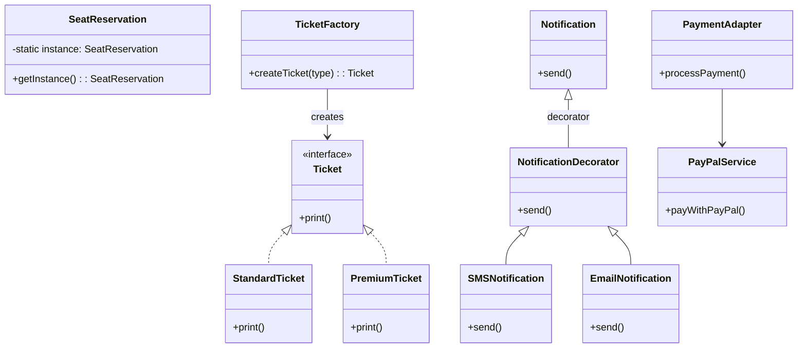

## **Exercise 1 (40 points)**

**1.** Which SOLID principle emphasizes depending on abstractions rather than concrete implementations?

A) Single Responsibility Principle

B) Dependency Inversion Principle

C) Interface Segregation Principle

D) Liskov Substitution Principle

**2.** In a message-driven architecture, which pattern ensures messages that fail delivery can still be analyzed and handled later?

A) Content-Based Router

B) Message Translator

C) Dead Letter Channel

D) Recipient List

**3.** The Adapter design pattern is primarily used for:

A) Creating complex objects

B) Decoupling abstraction from implementation

C) Allowing incompatible interfaces to collaborate

D) Dynamically adding behavior to objects

**4.** What integration style is best suited for near real-time, decoupled, asynchronous communication between multiple systems?

A) Shared Database Integration

B) Remote Procedure Invocation

C) File Transfer Integration

D) Message Broker Integration

**5.** Which design pattern ensures only one instance of a class exists within a system?

A) Prototype

B) Builder

C) Singleton

D) Factory Method

**6.** What is the main benefit of the Decorator pattern?

A) Optimizing memory usage

B) Providing a simplified interface

C) Dynamically extending object behavior

D) Decoupling abstraction from implementation

**7.** Which Enterprise Integration Pattern is used to standardize different input formats into a consistent representation?

A) Message Filter

B) Aggregator

C) Normalizer

D) Splitter

**8.** Which pattern involves wrapping a payload with additional metadata for improved routing, logging, and tracking?

A) Envelope Pattern

B) Normalizer

C) Message Translator

D) Aggregator

**9.** The Facade design pattern is best used when:

A) Controlling access to a single instance

B) Decoupling abstraction from implementation

C) Simplifying a complex subsystem’s interface

D) Sharing objects to reduce memory

**10.** Which Domain-Driven Design (DDD) pattern explicitly protects internal domain models from external complexity?

A) Shared Kernel

B) Anti-Corruption Layer

C) Published Language

D) Open-Host Service

## **Exercise 2 (20 points)**

You’re reviewing the architecture of an online ticket booking system with the following implementation:

* A `SeatReservation` class implemented as a Singleton, intended to manage seat bookings globally.
* A `TicketFactory` using the Factory Method pattern to generate different types of tickets (standard, premium).
* A `NotificationDecorator` applied to notification messages (SMS, Email) to dynamically add notification channels.
* A `PaymentAdapter` is used to standardize payment processing from various external payment gateways.

Analyze the depicted use of design patterns and clearly identify if each is correctly applied. For each incorrect usage, suggest a better-suited pattern clearly and justify your choice.

## **Exercise 3 (30 points)**

You're designing a real-time smart-home management system that tracks device states, automates device interactions, and integrates with external vendors for devices like thermostats, security cameras, and voice assistants. The system must handle sensitive homeowner data securely and respond instantly to environmental changes and homeowner commands.

Perform an architectural analysis clearly outlining:

1. **Domain Identification (Domain-Driven Design)**: Identify and define bounded contexts or domains relevant to the application. Provide a short explanation of purpose and included entities.

2. **Architectural Patterns and Integration Styles**: Select and justify suitable patterns/styles.

3. **Critical Non-Functional Requirements (NFRs)**: Select clearly from the provided word bank and explain their importance.

4. **Specific Enterprise Integration Patterns**: Identify and briefly describe relevant patterns.

### Common NFRs (for reference)

| | | | |
| --- | --- | --- | --- |
| Availability  | Performance | Scalability | Security |
| Reliability | Usability | Maintainability | Interoperability |
| Portability | Robustness | Responsiveness | Auditability | 
| Traceability | Compliance | Accessibility | Fault Tolerance | 
| Recoverability | Testability | Modifiability | Efficiency |
