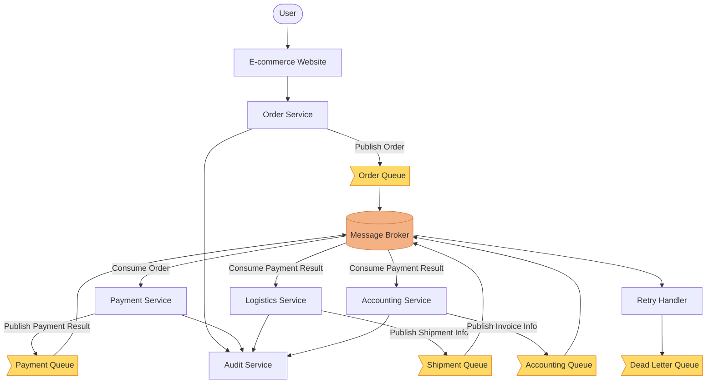
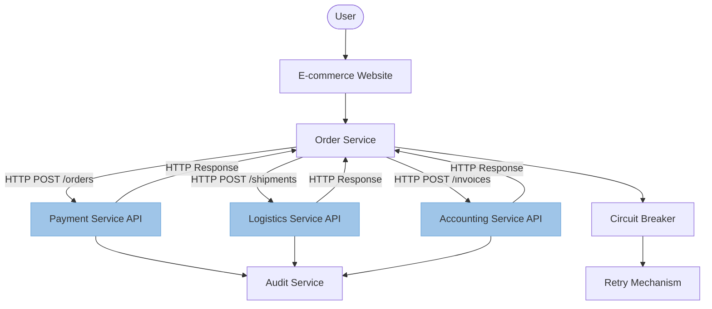
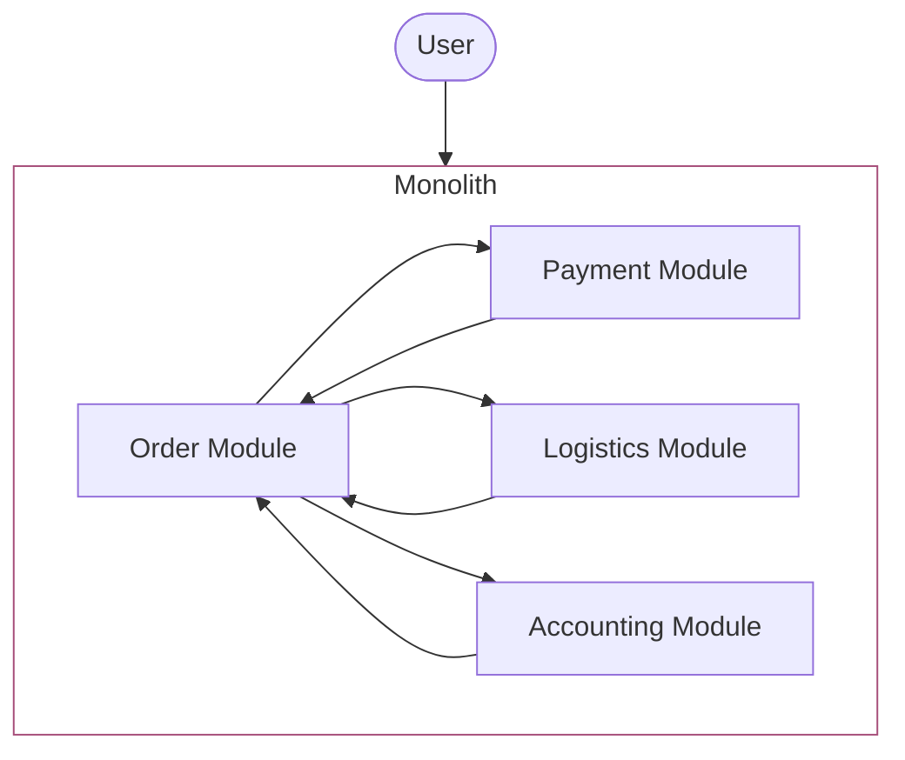

# Architecture comparisson

**Context:** An e-commerce website, that allows ordering of products, payments at checkout, handles dispatch and stock, emits invoices and handles errors that could appear throughout the lifecycle of the product. 

Compare how the application components integration the 3 examples, evaluating how the data flows, what needs to be developped to handle error cases and how the application fares in regards to data consistency. 

## Message Broker integration

## Webservice integration

## Modular Monolith

