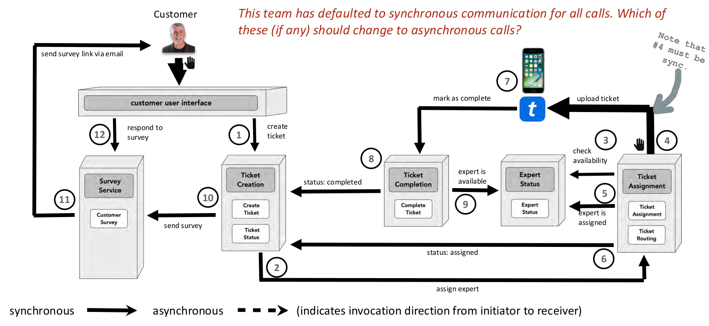

## Context

Below is a modelling of the processes inside a ticketing system for a handyman service. Users can open a ticket for a handyman, out of which an appropriate one is selected based on vecinity and skill after a lenghthy allocation process. Once the job is done, the handyman can mark the job as complete and become eligible to be allocated for new jobs. After this, a survey is sent to the requesting client to identify any improvement points. 

After launch, the application proved to be very slow and with a lot of delays within the process. Except for the step 4 which needs to remain synchronous, analyze all other steps and identify steps that can be async to speed up the process. 

